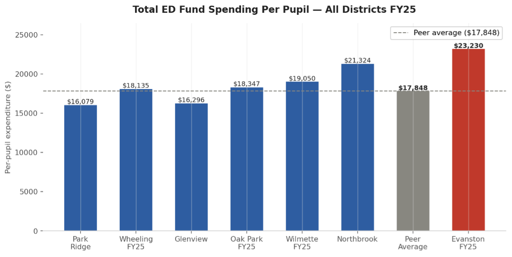
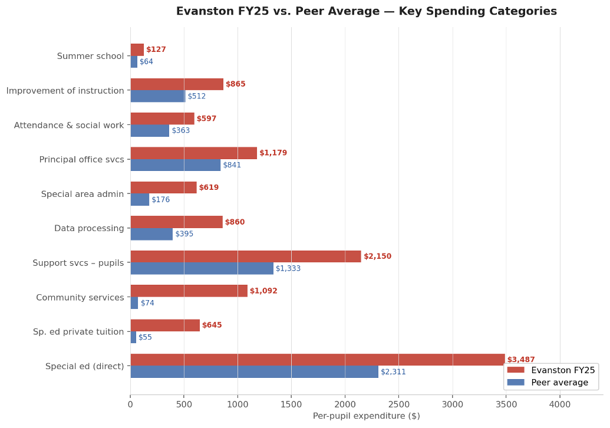
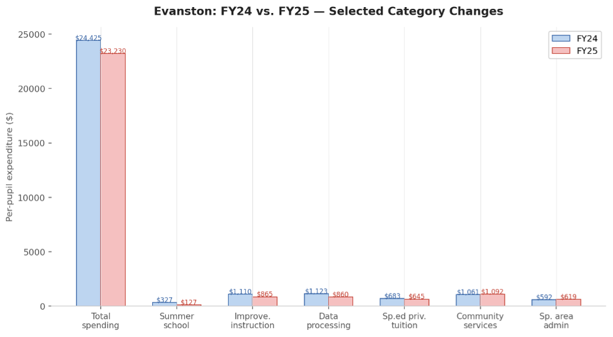

# How the D65 Budget varies from other districts

Below we provide information on per-student per-budget-line spending across local districts. This is a high-level look at districts and is intended to showcase a systematic, evidence-based approach to the budget that can provide guidance for spending reduction. Because these budgets are aggregated, there will need to be additional work to dig in and craft specific recommendations for the district. The core of this report (produced with Claude) is [available as a pdf here.](assets/Evanston_D65_Budget_Analysis.pdf) 

## Executive summary

Overall, Evanston is out-spending every peer district by at least $4,180 per student. Below, the biggest areas to explore for spending reductions are highlighted. Many of these may be able to be reduced by the start of FY26. These deserve a closer look. We did our best to verify these results -- please reach out with any questions or concerns. 

<table style="width: 100%; border-collapse: collapse; font-family: sans-serif;">
  <thead>
    <tr style="background-color: #f2f2f2; border-bottom: 2px solid #ccc;">
      <th style="padding: 10px; text-align: left;">Category (click title for budget details)</th>
      <th style="padding: 10px; text-align: left;">Evanston FY25</th>
      <th style="padding: 10px; text-align: left;">Peer Avg</th>
      <th style="padding: 10px; text-align: left;">Gap</th>
      <th style="padding: 10px; text-align: left;">Severity</th>
      <th style="padding: 10px; text-align: left;">Note</th>
    </tr>
  </thead>
  <tbody>
    <tr style="border-bottom: 1px solid #eee;">
      <td style="padding: 10px;">
        

          
<strong>Community services</strong>

          

            Function 3000 in ISBE accounting. This function is specifically designed for district activities that serve the broader community rather than enrolled students. Typical contents include district-operated before- and after-school care, community recreation, and staff time allocated to coordinating with municipal agencies.
          

        

      </td>
      <td style="padding: 10px;"><strong>$1,092</strong></td>
      <td style="padding: 10px;">$74</td>
      <td style="padding: 10px;">+$1,018</td>
      <td style="padding: 10px;"><strong>Critical</strong></td>
      <td style="padding: 10px;">14x peer avg; no peer comes close</td>
    </tr>
    <tr style="border-bottom: 1px solid #eee;">
      <td style="padding: 10px;">
        

          
<strong>Sp. ed private tuition</strong>

          

            Tuition payments to place students in private special education schools when the district cannot provide an appropriate program internally. Legally mandatory once determined by an IEP team. Costs vary from $40k to over $200k annually depending on placement intensity.
          

        

      </td>
      <td style="padding: 10px;"><strong>$645</strong></td>
      <td style="padding: 10px;">$55</td>
      <td style="padding: 10px;">+$590</td>
      <td style="padding: 10px;"><strong>Critical</strong></td>
      <td style="padding: 10px;">12x avg; Oak Park/Wilmette $0</td>
    </tr>
    <tr style="border-bottom: 1px solid #eee;">
      <td style="padding: 10px;">
        

          
<strong>Special ed (direct)</strong>

          

            Function 1200. Covers in-house spending for students with disabilities: teachers, paraprofessionals, therapists, and supplies. Driven by identification rates, disability categories, and staffing ratios used for self-contained or resource rooms.
          

        

      </td>
      <td style="padding: 10px;"><strong>$3,487</strong></td>
      <td style="padding: 10px;">$2,311</td>
      <td style="padding: 10px;">+$1,177</td>
      <td style="padding: 10px;"><strong>Critical</strong></td>
      <td style="padding: 10px;">Largest absolute gap; legally constrained</td>
    </tr>
    <tr style="border-bottom: 1px solid #eee;">
      <td style="padding: 10px;">
        

          
<strong>Support services — pupils</strong>

          

            Function 2100. Staff and programs supporting wellbeing outside of instruction: social workers, counselors, nurses, psychologists, and speech pathologists. These are salary-driven lines based on staffing levels relative to enrollment.
          

        

      </td>
      <td style="padding: 10px;"><strong>$2,150</strong></td>
      <td style="padding: 10px;">$1,333</td>
      <td style="padding: 10px;">+$817</td>
      <td style="padding: 10px;"><strong>High</strong></td>
      <td style="padding: 10px;">Att. & social work, psych, speech</td>
    </tr>
    <tr style="border-bottom: 1px solid #eee;">
      <td style="padding: 10px;">
        

          
<strong>Data processing</strong>

          

            Function 2600. Technology infrastructure: SIS licensing (Skyward/PowerSchool), network hardware, IT salaries, cybersecurity, and EdTech subscriptions. Often grows due to redundant platforms or old vendor contracts.
          

        

      </td>
      <td style="padding: 10px;"><strong>$619</strong></td>
      <td style="padding: 10px;">$176</td>
      <td style="padding: 10px;">+$443</td>
      <td style="padding: 10px;"><strong>High</strong></td>
      <td style="padding: 10px;">3.5x avg; rose FY24 to FY25</td>
    </tr>
  </tbody>
</table>

Overall, District 65 is overspending relative to peers with limited exceptions: gifted programming, Board of Education Services, CTE training, Payments for Special Education Programs - Tuition, and building expansion (all lower than peer averages). 

We (Nerds) are still exploring these items, such as community servies, and what they entail [see Claude's explanation here](#community-services) and this [2022-2023 D65 budget explainer](https://resources.finalsite.net/images/v1698044740/district65net/kd75wwohhwpjoc4hvfis/FY23Budget-At-A-Glance-Final.pdf) that states "Community Services - includes community childcare, Head Start, and school childcare services" (pg 11). We are also pursuing additional [potential data sources](https://www.isbe.net/ebfspendingplan) to expand our data. 

See [full analysis below](https://d65-legionofnerds.github.io/dataanalysis/budget_analysis.html#evanston-d65-budget-analysis) and [results as a pdf here.](assets/Evanston_D65_Budget_Analysis.pdf) 

# Technical details and information

## Data
The data are sourced from ISBE in their [online file database](https://cerberus.isbe.net/file/d/AFR/2024/School%20Districts/). All documents were sourced from the AFR folders in March of 2026 with an update in April of 2026 as more statements were available. To log in, the user name is `finread` and there is no password. 

The Expenditures tab was collected from each of the districts and in cell x1, the current enrollment for that school year was obtained from illinois report card and linked. The added column reports expenditures per student. 

### Peer groups
We used a list of comparator districts from [Evanston Roundtable Reporting(https://evanstonroundtable.com/2024/03/26/sizing-up-district-65-compared-to-peers-around-cook-county/) and [FoiaGras comparisons](https://foiagras.com/p/district-65-test-results-long-way-to-go). There have also been conversations (informally) regarding Wheeling as a potential comparator. We are still working to gather additional data but the current (4/22/26) list of districts included are as follows: Park Ridge (AFR 2024), Wheeling (AFR 2024, AFR 2025), Glenview (AFR 2024), Oak Park (AFR 2024, AFR 2025), Northbrook (AFR 2024). In cases where we have multiple AFR statements, the most recent is used to ensure only one statement per school in the *Claude* summary. We have both versions in the spreadsheet version (column P is all non-Evanston districts and column Q is most recent non-Evanston districts).

## Methods
The method of calculation is a simple average: each budget line by student enrollment. Initially, we had done this for each column of the spreadsheet, but we realized the `totals` column was the most helpful. The [raw data used are available in this spreadsheet](https://docs.google.com/spreadsheets/d/164TXxPV3pC4AHNtHoNGfHu4_6hQ-SvPHwNhjnSQkolM/edit?usp=sharing).

We took each row divided by the enrollment and then compared these values to one another. Then, we had a selection of peer group districts and compared their average to Evanston's average to get a sense of how different D65 spending has been.

## Claude
We additionally used Claude.ai to summarize the spreadsheet of information. We are presenting the full recommendation from Claude (unedited) here in the spirit of transparency.

Note that Claude can make mistakes. Please verify (and let us know!) if everything is correct.

# Evanston D65 Budget Analysis
**Per-Pupil Expenditure Comparison vs. Peer Districts | April 2026**  

---

## 1. Top-Level Snapshot
All figures represent per-pupil expenditures from the **Educational Fund** unless otherwise noted . Peer districts include Northbrook (G30), Park Ridge, Wheeling, Glenview, Oak Park, and Wilmette .

| Total Spending FY25 (per pupil) | Above Peer Average | Evanston FY24 to FY25 Change | ED Fund Deficit FY24 / FY25 |
| :--- | :--- | :--- | :--- |
| **$23,230**  | **+$5,382 (+30%)**  | **-$1,151 improvement** | **-$1,548 (FY24) / +$675 (FY25)**  |
| Peer average: $17,848   | vs. all peers in dataset   | From $24,425 to $23,230 | Swung to surplus in FY25 |

* Evanston's FY25 total per-pupil spending of $23,230 is approximately 30% above the peer average of $17,848.
* Evanston exceeds every peer by at least $4,180.
* The district improved its fiscal position from FY24 to FY25, swinging the ED fund from a $1,548 per-pupil deficit to a $675 surplus.

---

## 2. Evanston FY25 Spending Composition
Instruction makes up the largest share of Evanston spending, but support services and the anomalously high community services line represent significant gaps.

* **Instruction**: 59.9% 
* **Support services**: 32.9% 
* **Community services**: 4.7% 
* **Payments to other govts**: 1.7% 
* **Other**: 0.9% 

---

## 3. Key Spending Categories: Evanston vs. Peer Average
Evanston's per-pupil spending diverges most sharply from the peer average in several categories.

* **Special education (direct)**: $3,487 vs. $2,311 peer avg (Largest absolute dollar gap).
* **Community services**: $1,092 vs. $74 peer avg (14 times the peer average).
* **Sp. ed private tuition**: $645 vs. $55 peer avg (12 times the peer average).
* **Data processing**: $860 vs. $395 peer avg (Double the peer average).

---

## 4. Where Evanston Should Consider Cutting — and Why
Several categories are substantially above peer levels and warrant discretionary review.

* **Community Services ($1,092/pupil)**: Evanston spends 14 times the peer average; the district should itemize exactly what this covers.
* **Special Education Private Tuition ($645/pupil)**: At 12 times the peer average, this warrants a review of whether in-district programming can substitute for private placements.
* **Data Processing ($860/pupil)**: Technology spending is twice the peer average despite Evanston's enrollment size, which should favor economies of scale.
* **Special Area Administration ($619/pupil)**: This category rose from FY24 to FY25 and sits at 3.5 times the peer average.
* **Pupil Support Services ($2,150/pupil)**: Attendance and social work alone ($597/pupil) is the highest of any peer in the dataset.

---

## 5. Key Areas to Focus: Most Egregious Differences

| Category | Evanston FY25 | Peer Avg | Gap | Severity | Note |
| :--- | :--- | :--- | :--- | :--- | :--- |
| Community services | **$1,092** | $74 | +$1,018 | **Critical** | 14x peer avg; no peer comes close  |
| Sp. ed private tuition | **$645** | $55 | +$590 | **Critical** | 12x avg; Oak Park/Wilmette $0  |
| Special ed (direct) | **$3,487** | $2,311 | +$1,177 | **Critical** | Largest absolute gap; legally constrained  |
| Support services — pupils | **$2,150** | $1,333 | +$817 | **High** | Att. & social work, psych, speech  |
| Data processing | **$860** | $395 | +$465 | **High** | 2x avg; discretionary tech contracts  |
| Special area admin | **$619** | $176 | +$443 | **High** | 3.5x avg; rose FY24 to FY25  |

---

## 6. Data Quality Issues and Inconsistencies
The following issues should be resolved before using this analysis in formal presentations.

| Type | Issue | Detail |
| :--- | :--- | :--- |
| **Error** | Wheeling FY25 O&M fund = $0 | Likely missing data; makes excess/deficiency rows meaningless for Wheeling FY25. |
| **Warning** | Average column mixes FY24/FY25 | Blends figures from different years rather than comparing a consistent year. |
| **Warning** | Northbrook labeled 'G30' | May be a K-8 or elementary district; including it may distort comparisons. |
| **Note** | Scientific notation | Values like 7.27E-3 indicate rounding artifacts and are functionally zero. |

---
**Prepared by:** Legion of Data Nerds 
**Source:** Illinois Report Card district expenditure data 

### Claude prompt
This is a comparison of different school district spending. What areas should Evanston consider cutting in to improve their budget relative to peer districts and why? Highlight any errors, issues, or inconsistencies
Additionally, give me the following:

* a tl;dr of Evanston FY24 vs FY 25 with clear paragraphs and bullet points
* a tl;dr of FY 24 vs 25 for other districts 25 with clear paragraphs and bullet points
* a tl;dr of Evanston vs other districts 25 with clear paragraphs and bullet points
* a table of key areas to focus (most egregious differences)
* an infographic to illustrate the above

## Community services
(results from Claude query regarding their definition)
In Illinois school district accounting (which follows the ISBE chart of accounts), Community Services is Function 3000 in the Educational Fund. It is a catch-all for district activities that benefit the broader community rather than enrolled students directly. Typical line items include:

### Most common: 
* Before- and after-school programs (latchkey/extended care), especially when operated by the district rather than a third party
* Community recreation programs run by the district
* Parent education and family literacy programs
* Preschool programs open to the general public (not just IEP-mandated placements)
* Adult education and continuing education courses not captured elsewhere
* Community use of school facilities coordination and staffing costs

### Moderately common: 
* Early childhood screening programs beyond what IDEA requires
* Health and social services provided to the community through school facilities (clinics, mental health services open to non-students)
* Civic and cultural programs hosted by the district
* Summer programs open to non-enrolled community members
  
### Less common but present in some districts: 
* Costs associated with community partnerships (staff time allocated to coordinating with parks districts, libraries, city agencies)
* Non-student-facing communications and community engagement staff
* Some districts park certain wraparound services here if they serve families broadly rather than just enrolled students

### Why Evanston’s number is so large: 
At $1,092 per pupil versus a peer average of $74, Evanston is almost certainly running significant district-operated early childhood or community programs, or has allocated costs here that peers classify differently. Two likely explanations worth investigating:

First, Evanston has a well-known Early Childhood program. If the district is absorbing substantial early childhood program costs — staff salaries, benefits — and classifying them under Function 3000 rather than Pre-K instruction, that would inflate this line significantly relative to peers who either do not run such programs or classify them differently.

Second, some districts use this function to capture costs related to community schools or wraparound services models, which Evanston has invested in more heavily than most suburban peers. If community school coordinators, family liaisons, and related social support staff are budgeted here, that could account for a large portion of the gap.

The key question for the board is not just how much is spent here, but whether the object-code breakdown shows it is primarily salaries and benefits (suggesting ongoing staffing commitments) versus purchased services or supplies (more easily reduced). A line this far above peers almost always reflects deliberate programmatic choices, not accounting noise.

# Reporting errors
If you identify any errors or issues, please contact [d65.legionofnerds@gmail.com](mailto:d65.legionofnerds@gmail.com)
