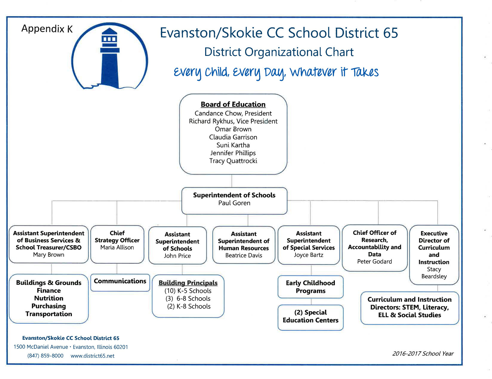
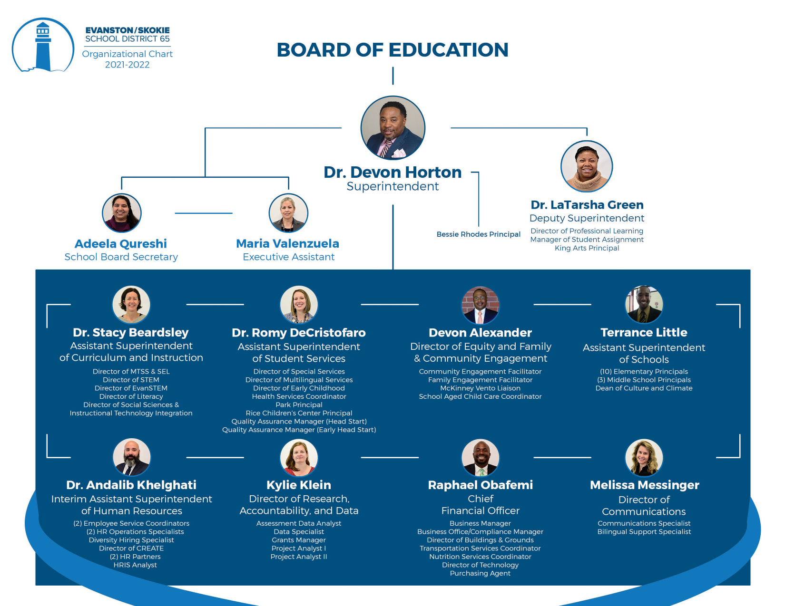
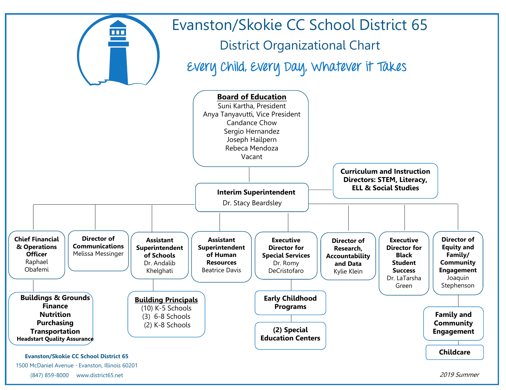
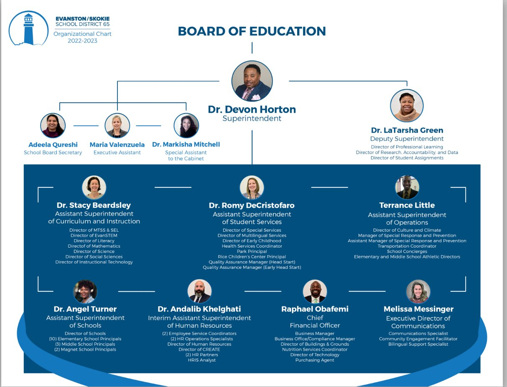
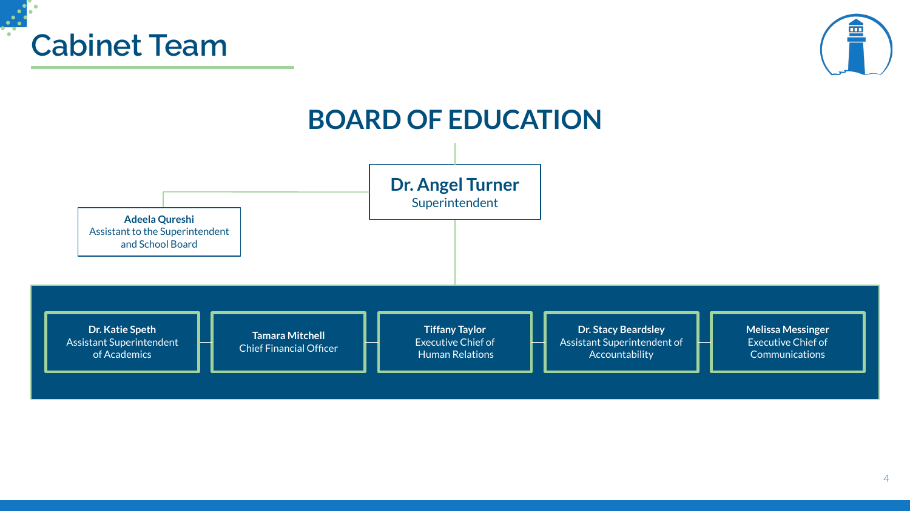
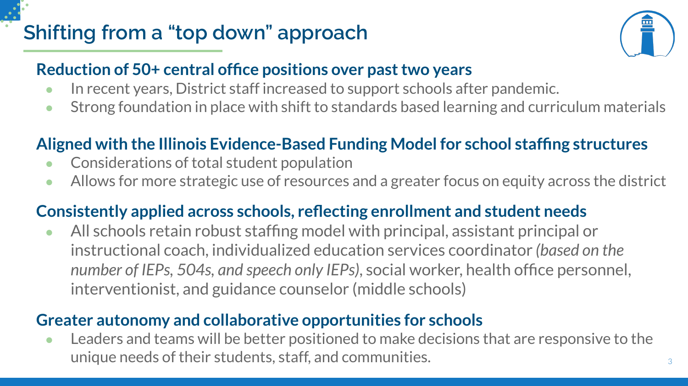
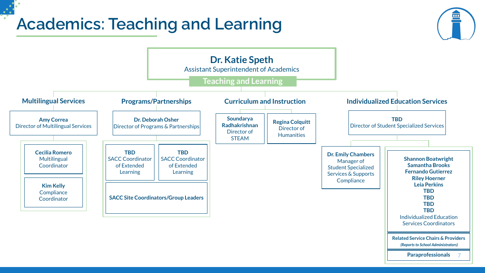

# The Org Chart That Ate Our Budget

**A Legion of Data Nerds structural history of District 65's administrative organization — how org chart creep doubled the central office, what the SDRP dismantled, and** **<big>what still needs to go.</big>**

**[District 65 Administrative Growth Over Time](admin-growth-final)** — the companion analysis covering inflation-adjusted compensation trends, headcount data, peer comparisons, and right-sizing scenarios in dollar terms.

<svg viewBox="0 0 680 180" width="100%" role="img" xmlns="http://www.w3.org/2000/svg">
  <title>Pac-Man chomping through dollar signs</title>
  <desc>Animated D65-blue Pac-Man eating dollar signs representing budget consumption</desc>
  
  <rect x="20" y="40" width="640" height="100" rx="12" fill="#f5f0e8" stroke="#a89f92" stroke-width="1"/>
  <g style="transform-origin:142px 100px"><text class="dollar d1" x="128" y="102">$</text></g>
  <g style="transform-origin:222px 100px"><text class="dollar d2" x="208" y="102">$</text></g>
  <g style="transform-origin:302px 100px"><text class="dollar d3" x="288" y="102">$</text></g>
  <g style="transform-origin:382px 100px"><text class="dollar d4" x="368" y="102">$</text></g>
  <g style="transform-origin:462px 100px"><text class="dollar d5" x="448" y="102">$</text></g>
  <g style="transform-origin:542px 100px"><text class="dollar d6" x="528" y="102">$</text></g>
  <g style="transform-origin:622px 100px"><text class="dollar d7" x="608" y="102">$</text></g>
  <circle class="crumb c1" cx="105" cy="90"/>
  <circle class="crumb c2" cx="185" cy="90"/>
  <circle class="crumb c3" cx="265" cy="90"/>
  <circle class="crumb c4" cx="345" cy="90"/>
  <circle class="crumb c5" cx="425" cy="90"/>
  <circle class="crumb c6" cx="505" cy="90"/>
  <g id="pacman">
    <path fill="#185FA5" stroke="none">
      <animate attributeName="d"
        values="M68,91 A28,28 0 1,1 68,89 L40,90 Z;M64.2,104 A28,28 0 1,1 64.2,76 L40,90 Z;M68,91 A28,28 0 1,1 68,89 L40,90 Z"
        dur="0.32s" repeatCount="indefinite"/>
    </path>
    <circle cx="34" cy="72" r="4.5" fill="white"/>
    <circle cx="35" cy="72" r="2.5" fill="#0C447C"/>
  </g>
</svg>

<table width="100%" cellspacing="12" cellpadding="0" style="border-collapse:separate;border-spacing:12px;">
<tr>
<td width="33%" align="center" valign="top" style="background:#fdecec;border-top:5px solid #e84040;border-radius:6px;padding:20px 14px;">

+118%

Certificated central admins (TRS)

11 → 24 administrators

SY2015–16 → SY2025–26 · combined cabinet + sub-cabinet peaked at 60 in 2022–23

</td>
<td width="33%" align="center" valign="top" style="background:#fdf1e7;border-top:5px solid #e87d20;border-radius:6px;padding:20px 14px;">

7×

Sub-cabinet growth

6 → 42 positions (700% of baseline)

Cabinet cut 50% · Sub-cabinet cut only 13%

</td>
<td width="33%" align="center" valign="top" style="background:#fdf6e3;border-top:5px solid #e8b820;border-radius:6px;padding:20px 14px;">

+67%

Admin-to-student ratio

10.0 → 16.7 per 1,000 students

peer K-8 average ~12 per 1,000

</td>
</tr>
<tr>
<td width="33%" align="center" valign="top" style="background:#fdecec;border-top:5px solid #e84040;border-radius:6px;padding:20px 14px;">

10+

Admins missing from official count

District reports 52 · public data shows 64

No FOIA request required to find the gap

</td>
<td width="33%" align="center" valign="top" style="background:#fdf1e7;border-top:5px solid #e87d20;border-radius:6px;padding:20px 14px;">

+55%

Per-student admin spending (real $)

$2,201 → $3,401 per pupil

FY16 → FY25 · inflation-adjusted

</td>
<td width="33%" align="center" valign="top" style="background:#fdf6e3;border-top:5px solid #e8b820;border-radius:6px;padding:20px 14px;">

−25%

Student enrollment

7,500 → 5,625 students

steepest among 21 peer districts

</td>
</tr>
</table>

*Legion of Data Nerds · May 7, 2026 · ~40 min read · Based on FOIA documents, compensation reports, and board presentations*

## What You Need to Know

Between SY2015–16 and SY2025–26, K-8 enrollment fell from approximately 7,500 to 5,625 students — a 25% decline, the steepest among 21 nearby K-8 districts. Over the same period:

- **Enrollment fell 25%. Administrative cost per student rose 55%.** Those two lines moved in opposite directions for a decade. The community is paying the price in closed schools, partially cut counselors, and librarians whose roles remain unresolved.
- **It didn't happen all at once — it was org chart creep.** Positions were added one at a time, each justified on its own terms, none examined in the aggregate. No single hire looked unreasonable. The cumulative result did.
- **The peak was 2022–23 — the same year the district ran a $10 million deficit.** Central office administrators had grown 118% since 2016. Many hires were presented to the board as "budget neutral" while structural deficits were already being projected.
- **The real story is the second tier — the sub-cabinet.** Below the cabinet sits a layer of directors, coordinators, and managers that grew 7× its 2016 size — 700% of baseline — and has barely been touched by the SDRP. The cabinet was cut 50%. The sub-cabinet was cut only 13%. The visible layer shrank. The expensive layer didn't.
- **The SDRP made real cuts — but didn't finish the job.** 90 position reductions still produced a $700,000 increase in total salary costs. Fewer people, higher total cost. The sub-cabinet's 42 positions — each averaging $129,000 in total compensation — remain largely intact. D65 still spends $619 per pupil on Special Area Administration against a peer average of $176.
- **You can't govern what you can't see.** The district officially reports 52 central administrators. Cross-referencing public state disclosure lists — no FOIA required — yields at least 64. The 10+ missing positions aren't a data entry error; they reflect a pattern of incomplete reporting that leaves the board making decisions based on an incomplete count.
- **The governance failures go deeper than the org chart.** A cabinet-level "Chief of Staff" signed contracts under that title while board org charts listed her as "Special Assistant to the Cabinet." Salary increases were made without board approval. Two Horton-era associates are awaiting trial on fraud-related charges.
- **Four things need to change — now.** The ongoing HR audit is the opening. The Legion of Data Nerds calls on the board and administration to act on each of the following: **(1) Right-size the sub-cabinet** — a conservative reduction to 20 positions saves $2.8–3.8M annually without touching a teacher, counselor, or librarian. **(2) Stop future creep** — require board approval for any new administrative position above a salary threshold. **(3) Publish the full roster** — every administrative position, title, reporting line, function, and cost in one publicly accessible document. **(4) Build a real accountability framework** — the board, not the superintendent, sets the size and cost of the administrative structure.

The +118% headline figure measures TRS-enrolled certificated administrators specifically (PA 96-0434), which went from 11 to 24 between SY2015–16 and SY2025–26. This is a narrow, clean measure — every TRS administrator is reported in full regardless of salary, making it the most apples-to-apples count across years. Larry Gavin's broader "Central Office Administration" category shows growth from 17 (2015–16) to 30 (2022–23), a +76% increase; the District's own FOIA response (May 7, 2024) documents Central Office Adm rising from 22 in FY19 to 30 in FY23. All three counts use different definitions and scopes; all three show the same directional trend. For full methodology see the [Admin Growth FAQ](admin-growth-faq).

---

## How We Got Here

District 65 is in a budget crisis. Enrollment has fallen. Counselors were partially cut and librarians reprieved — but both remain in limbo. Schools have been closed. And yet for years, one of the fastest-growing parts of the district wasn't classrooms or teacher compensation. It was the central office.

This analysis documents what happened to D65's central office between 2016 and today — a textbook case of what we call **org chart creep**. Positions multiplied one at a time, each justified on its own terms, none examined in the aggregate. The cumulative result: a central office that more than doubled while enrollment fell by a quarter. That is **administrative bloat** — a structure whose size and cost became disconnected from the student population it serves.

The numbers are stark. Enrollment fell 25% — the steepest decline among 21 nearby K-8 districts. Over the same period, higher-paid administrative headcount grew 25%, and central office administrators specifically doubled. Total administrative pay rose 21% in real (inflation-adjusted) dollars. Per-student administrative spending rose 55% in real terms. The cost driver was not higher salaries — individual administrator pay only kept pace with inflation. The cost driver was adding more administrators.

> **Companion Piece** — This deep dive traces the *structural history* of D65's administrative organization: the org charts, the governance failures, the titles and reporting lines. For the full *quantitative and financial* analysis — inflation-adjusted compensation trends, headcount data, peer comparisons, and right-sizing scenarios — see [District 65 Administrative Growth Over Time →](admin-growth-final). For answers to common methodological questions, see the [Admin Growth FAQ →](admin-growth-faq).

This piece traces who was hired, why, at what cost, and what remains. The data comes from board-approved org charts, state compensation reports, SDRP (Structural Deficit Reduction Plan — the district's 2025 cost-cutting initiative) board presentations, and the Legion's own analyses. The picture is not flattering.

Counselors were partially cut and librarians threatened with reassignment then reprieved — positions that exist to directly serve children, now caught in ongoing uncertainty. The structures driving costs stayed protected. The SDRP has since made real cuts to the central office, but bloat does not disappear because headcount drops. Understanding what was built and what remains matters — because the community is being asked to trust that this will not happen again.

---

## Where D65 Started: The 2016–17 Structure

Under Superintendent Paul Goren, District 65 operated with a relatively streamlined central office. The core leadership team consisted of eight senior positions covering the essential functions of a mid-size urban district: Superintendent, Asst. Supt. of Business Services, Chief Strategy Officer, Asst. Supt. of Schools, Asst. Supt. of Human Resources, Asst. Supt. of Special Services, Chief Officer of Research & Data, and Executive Director of Curriculum & Instruction.

Curriculum and instruction was managed by four directors — covering STEM, Literacy, ELL, and Social Studies. Operations were consolidated under business services. This was a functional structure for a district of D65's size and complexity.

A note on what we are *not* arguing: the 2016–17 structure is a reference point, not a target. Education has changed since then — multilingual services, social-emotional learning, early childhood programs, and equity-focused support have all grown, and some of that investment is legitimate. (SPED costs also rose dramatically — but driven by transportation and contracted services, not by central office positions.) The question is narrower: was the scale of sub-cabinet growth proportionate to enrollment and to demonstrated need? Did it produce better outcomes for students? The evidence available to us does not support a yes on either count.

*The Goren-era structure: eight senior positions, four curriculum directors, operations consolidated under business services. Compare this to what follows.* — [FOIA Gras doc 6510](https://ig.foiagras.com/api/public/chat/documents/6510/view){:target="_blank"}

This baseline matters because it anchors the question the rest of this analysis tries to answer: how much larger does a central office need to be to serve 25% fewer students — and is the answer D65 has been living with defensible? The next section documents what the Horton era built on top of this foundation.

---

## The Horton Era: When the Org Chart Doubled

Devon Horton arrived as superintendent in June 2020 with the MIRACLES framework — an eight-component reform agenda that required, by its own design logic, significant new administrative infrastructure. The pandemic added further justification for expanded coordination capacity.

What followed was one of the most rapid expansions of central office administration in the district's recent history — and it happened on both tiers simultaneously. The cabinet grew, but so did the sub-cabinet layer of directors, coordinators, and managers below it. It did not peak in 2021–22. The cabinet kept growing, reaching 12 members by 2022–23 (including the Deputy Superintendent position), the same fiscal year the district reported a $10 million operating deficit.

The expansion was broad-based. A Deputy Superintendent position was created for Dr. LaTarsha Green. Seven assistant superintendents replaced the prior four or five. The curriculum and instruction division gained dedicated directors for MTSS (Multi-Tiered System of Supports — a framework for identifying struggling students before special education referral) & SEL, STEM, EvanSTEM, Literacy, and Social Sciences — plus four Content Facilitator positions. New administrative units appeared for equity and family engagement, culture and climate, diversity hiring, and instructional technology.

| Function | 2016–17 | 2022–23 Peak |
| --- | --- | --- |
| Central Admin | 8 positions | 12 cabinet (incl. Deputy Supt.) |
| Curriculum & Instruction | 4 directors + 1 exec | 7 directors + facilitators |
| Student Services / SPED | 1 asst. superintendent | 3+ directors under 1 asst. supt. |
| Technology / IT | — embedded roles | 3+ dedicated positions |

*The full expansion: Deputy Superintendent LaTarsha Green, seven assistant superintendents, specialized directors across every curriculum area. This is the structure the SDRP was built to dismantle. The chart also shows one structural anomaly: the Bessie Rhodes and King Arts principals reported directly to the Deputy Superintendent rather than through the Assistant Superintendent of Schools like every other building principal. No public document explains the rationale.* — [FOIA Gras doc 3180](https://ig.foiagras.com/api/public/chat/documents/3180/view){:target="_blank"}

The 2022–23 expansion also surfaced a transparency problem that goes beyond headcount. A January 2023 consulting contract — obtained via FOIA by Evanston resident Tom Hayden — was signed by Markisha Mitchell with the title **Chief of Staff**. The board-facing org chart circulated during the same period listed her role only as "Special Assistant to the Cabinet." The discrepancy is not a clerical error — it is a governance failure.

The Mitchell case also illustrates a broader pattern: administrative salary increases during this period were made without board approval, removing a key oversight mechanism. The org chart creep documented in this analysis was not just an organizational choice — it was enabled by a culture in which decisions about titles, compensation, and structure happened outside the board's line of sight.

That culture had consequences beyond the balance sheet: Devon Horton and two associates connected to his administrative network are currently awaiting trial on fraud-related charges.

Many of these hires were presented to the board as "budget neutral" — offset by eliminating other positions or cutting contracted services. But the district was already projecting structural deficits starting in FY22. The expansion happened anyway. The fiscal warning signs were visible. The administrative build-up continued regardless.

*The bridge year: Beardsley as Interim Superintendent. LaTarsha Green already elevated to Executive Director for Black Student Success. A Director of Equity and Family/Community Engagement added. The groundwork for what follows is visible here.* — [FOIA Gras doc 4479](https://ig.foiagras.com/api/public/chat/documents/4479/view){:target="_blank"}

Why does this expansion matter now? Because the district is asking families to accept school closures, partially cut counselors, and librarians whose status remains unresolved — while a central office built during a period of fiscal warnings and flat academic outcomes remains largely intact.

> **From the Record** — Devon Horton told the Finance Committee in August 2020 that "as a new leader to the district, he made some hiring decisions to steer the vision." Positions added during this period included an Equity Coach at $110,000, two Deans of Culture and Climate at a combined $196,858, and a Diversity Hiring Specialist at $95,500 — all in a year when the district was already aware of an emerging structural deficit.

The expansion accelerated further in SY2022–23. The largest single-year jump in the dataset came partly from reclassifying support staff into administrator categories — a change that obscured the true scale of the build-up in standard reporting. New additions included a Family Center Managing Director, Director of Science, Diverse Learning Coordinator, Executive Director of Technology, and multiple coordinator positions. All while student enrollment was falling and academic results were not improving.

*The true structural peak. By 2022–23 the cabinet stood at 12 members — including Deputy Superintendent Green and a newly created Chief of Staff position (Dr. Markisha Mitchell) with a DEIB and equity portfolio. The Chief of Staff role had no parallel in any prior org chart and did not survive Horton's departure.* — D65 Board Documents

### Timeline of the Build-Up and Pull-Back

- **June 2020 — Horton arrives.** MIRACLES framework announced. Deputy Superintendent created; assistant superintendent count grows; new equity, culture, and diversity roles added.
- **2020–2022 — Administrative expansion continues.** Eight-plus curriculum directors; dedicated coordinators for technology, multilingual services, SEL, MTSS; four content facilitators added. Cabinet reaches 10 members.
- **2022–2023 — True peak; transparency failure documented.** Chief of Staff (Dr. Markisha Mitchell) added at cabinet level with DEIB and equity portfolio. Curriculum directors expand to 7. Cabinet reaches 12 members (inclusive of the Deputy Superintendent). The district runs a $10 million operating deficit. A FOIA request later reveals Mitchell's contract was signed as "Chief of Staff" while board-facing org charts listed her only as "Special Assistant to the Cabinet." Salary increases made without board approval.
- **FY22 — Structural deficit projections emerge.** District projects ongoing structural imbalance — the same fiscal year the expanded administrative structure reaches full cost.
- **2024–2025 — SDRP Phase I: 22 central office FTEs eliminated.** Deputy Superintendent, two Chiefs of Academics, multiple directors and facilitators removed.
- **2025–2026 — SDRP Phase II: additional 21–26 FTEs proposed.** Further consolidation; specialized director positions collapsed into Humanities and STEAM roles.
- **Today — Current structure: leaner, but questions remain.** Five senior leaders plus the Superintendent, two consolidated director positions — smaller than the 2016–17 baseline on paper, but per-pupil peer benchmarks still show D65 above peers on administrative spend. The post-SDRP cabinet retains an Executive Chief of Human Relations and an Executive Chief of Communications — Horton-era additions that survived the cuts.

---

## What the SDRP Actually Did

Before looking at the cuts, one important context: some of the staffing increase in FY22–23 was funded by federal COVID-recovery grants (ESSER funds), which were temporary by design. These included 19 Teacher Residents, 8 Guidance Counselors, 2 Mental Health Practitioners, and 4 Diverse Learning Coordinators — roughly 33 positions that were always going to expire. Their elimination is not really a "cut" — it was a scheduled end. The more durable concern is the permanent central office administrative build-up: directors, coordinators, and support roles that were not tied to temporary grants.

The SDRP achieved meaningful reductions in headcount. Across Phases I and II, the district eliminated at least 43–48 central office and administrative FTE positions, generating roughly $3.07 million in direct central office savings from 25 net FTE reductions in Phase II alone. For a full financial breakdown of what the SDRP savings represent relative to the decade-long administrative cost buildup, see our companion piece [District 65 Administrative Growth Over Time](admin-growth-final).

<table width="100%">
<tr>
<td align="center">22</td>
<td align="center">21–26</td>
<td align="center">$3.07M</td>
</tr>
<tr>
<td align="center">Central office FTEs eliminated</td>
<td align="center">Additional FTEs reduced</td>
<td align="center">Central office savings</td>
</tr>
<tr>
<td align="center"><small>SDRP Phase I (FY25)</small></td>
<td align="center"><small>SDRP Phase II (FY26)</small></td>
<td align="center"><small>from Phase II alone</small></td>
</tr>
</table>

The *RoundTable* documented a striking paradox in the FY26 numbers: the board approved 90 position reductions, yet total salary and benefit costs actually rose by about $700,000 — from $132.6 million to $133.3 million. Fewer people, higher total cost. That is what happens when restructuring eliminates lower-paid positions while preserving high-compensation ones.

The eliminated positions read like a reversal of the Horton-era expansion: Deputy Superintendent, two Chiefs of Academics & School Management, Assistant Superintendent of Safety & Climate, Assistant Superintendent of Student Specialized Services, Director of Math, Director of Science, Director of Social Studies, Director of Training & Development, Director of Culture & Climate, four Content Facilitators.

In curriculum and instruction, the eight-plus director structure was collapsed into two consolidated roles: Director of Humanities and Director of STEAM. That is genuine organizational change, not just shuffling titles.

*The post-SDRP cabinet: five senior positions replacing what had been twelve plus a deputy-level executive director tier. The district's own framing called this "shifting from a top-down approach." **Important:** this slide shows the cabinet only. Seventeen additional central office administrators report through this structure — directors, executive directors, and coordinators whose positions and compensation are not visible here.* — [FOIA Gras doc 4162](https://ig.foiagras.com/api/public/chat/documents/4162/view){:target="_blank"}

*The district's stated rationale for the restructuring. Note the acknowledgment that "District staff increased to support schools after pandemic" — a concession that the expansion was real.* — [FOIA Gras doc 4162](https://ig.foiagras.com/api/public/chat/documents/4162/view){:target="_blank"}

The SDRP corrected the most visible part of the problem — the bloated cabinet. What it did not correct is the underlying structural condition: a central office still calibrated to a larger district than D65 is today, with a second administrative tier that has barely been touched.

---

## The Structure That Survived the Cuts

Headcount reduction is not the same as cost reduction, and organizational restructuring does not guarantee institutional reform. Three issues deserve scrutiny in the current structure.

### 1. Executive Compensation Remains High

The 20 TRS-enrolled administrators carry combined total compensation of approximately **$3.74 million annually**. The four most senior positions account for nearly **$981,000** of that total. This in a district that cut two counselors, threatened librarians with reassignment, and is asking staff to absorb further cuts.

The full FY26 senior administrator compensation roster (PA 96-0434, TRS-disclosed):

| Cabinet (TRS disclosed) | Total Compensation |
| --- | ---: |
| Superintendent | $286,378 |
| Chief Financial Officer | $259,525 |
| Asst. Supt. of Accountability | $239,474 |
| Asst. Supt. of Academics | $195,427 |

| Directors & Managers | Total Compensation |
| --- | ---: |
| Director of Schools Management | $213,371 |
| Director of MTSS & SEL | $200,952 |
| Director of Early Childhood Programs | $194,807 |
| Director of Finance | $192,453 |
| Manager of Student Specialized Services | $186,904 |
| Director of Humanities | $182,363 |
| Exec. Director of RAAD (Research, Assessment, Accountability, and Data)| $177,066 |
| Director of Student Specialized Services | $175,971 |
| Director of STEAM | $173,684 |
| Exec. Director of Technology | $170,188 |
| Director of Multilingual Services | $162,675 |
| Director of Buildings, Grounds & Transportation | $148,542 |
| Director of Programs & Partnerships | $147,452 |
| Asst. Director of Teaching & Learning | $146,415 |
| Director of Climate & Safety | $146,407 |
| Health Services Director | $143,809 |

Base salary average: $152,234. Total comp average: $187,193.

There are two additional cabinet positions that appear in the IMRF disclosure (salaries over $75,000):

| Cabinet (IMRF-disclosed) | Total Compensation | 
| --- | ---: |
| Executive Chief of Human Relations | $200,181 |
| Executive Chief of Communications | $182,439  | 

> **Beyond the Cabinet** — The roster above shows all 20 TRS-disclosed administrator positions and two additional Executive Chief cabinet positions — the complete picture the board-facing org chart does not show. The 16 directors and managers below the cabinet account for $2.76 million in total compensation annually. This is the layer where right-sizing work most directly remains, and where peer-norm benchmarking should focus first.

### 2. Administrative Support Positions Stay Above $75K

A second state compensation list — the IMRF report, covering non-certificated staff earning over $75,000 — shows another layer the SDRP largely left untouched. Communications Manager at $108,145. Infrastructure Manager at $135,345. Multiple administrative assistants and specialists above $75,000. Some of these are legitimate specialized roles. But this layer received the least scrutiny in the SDRP process, and peer comparisons here could be the most revealing.

The *RoundTable*'s March 2026 analysis found 80 employees at the JEH administration building holding administrative, director, manager, coordinator, or chief titles — out of 200 people working there. (To be clear: our scrutiny is directed at the administrative structure, not at the student-facing staff also housed at JEH — early childhood, special education, health services, and nutrition staff who are there to serve children, not to administer.) Until the district benchmarks this layer against comparable districts and explains departures from peer norms, it cannot credibly claim its support structure is sized for the district it actually is.

### 3. Special Area Administration Remains a Peer-Comparison Problem

Our earlier peer budget analysis flagged Function 2490 (Special Area Administration — the Illinois budget category for central-office spending on specialized programs like gifted and bilingual services) as one of D65's most significant outliers: **$619 per pupil versus a peer average of $176**. That is 3.5 times the peer average. Northbrook manages at $355. Wilmette at $144.

> **The Core Issue** — The SDRP reversed much of the org chart creep documented in this analysis. What it did not resolve is the structural question of whether D65's remaining administrative architecture — its functions, spans of control, and cost-per-pupil — is calibrated to actual student need, or simply to historical practice and accumulated organizational commitments. Until the district can show peer-comparable per-pupil administrative spending, the question of institutional bloat remains open.

> **On Student Achievement** — The *RoundTable* noted that higher staff-per-student ratios have not produced better outcomes. On the 2018 state assessment, 44.8% of D65 students met the math proficiency benchmark. By 2024, that figure had fallen to 42.3%. A district with more administrators per pupil and declining academic results carries a heavy burden of proof when arguing that the current staffing model is structured around student outcomes.

Community Services (Function 3000 — the Illinois budget category covering childcare, Head Start, and before- and after-school programs) spending is a separate outlier. D65 spends **$1,092 per student** on this function versus a peer average of **$74** — 14 times the peer norm, with no peer district close. The SDRP did not address this line. The district has not explained what sits in it.

### 4. Student-Facing Cuts vs. Administrative Right-Sizing

The contrast between what was cut and what was protected is sharpest when you put the numbers side by side. Nine middle-school counselors were initially targeted for layoff — the board reversed seven of those, leaving two positions eliminated, saving approximately $200,000 annually. All three middle-school librarians were slated for reassignment away from their librarian functions at Chute, Haven, and Nichols — the board reversed that action entirely, saving approximately zero in direct salary costs. Both situations remain unresolved: the two cut counselor positions are gone, the seven reversed counselors and three librarians face an uncertain future, and the district has not clarified what permanent staffing looks like for either role.

By contrast, returning D65's administrative headcount toward peer-district norms would generate savings that dwarf the counselor and librarian actions many times over. The counselor reductions and librarian threats were the visible sacrifice. The administrative layer was the protected one.

---

## The Layer the Org Chart Doesn't Show

The cabinet-level org chart — the one presented to the board and published publicly — captures only the top tier of the administrative structure. Below it sits a second layer of directors, coordinators, executive directors, and managers that has grown substantially since 2016, peaked alongside the cabinet in 2022–23, and contracted far less under the SDRP. This is where the bulk of the day-to-day administrative cost lives, and it is the layer that has received the least public scrutiny.

In 2016–17, the sub-cabinet central office tier was lean: four curriculum directors, a handful of operations positions, and little else named in the org chart — roughly 5 to 7 positions in total. By 2019, the first new layer had appeared: a Director of Research, Accountability and Data, an Executive Director for Black Student Success, and a Director of Equity and Family/Community Engagement — positions that were new functions, not replacements. By 2021–22, under Horton, the sub-cabinet had roughly quintupled: five curriculum directors, a full student services administrative layer, dedicated HR coordinators, data analysts, community engagement staff, and operations coordinators across every functional area. The 2022–23 peak added further: separate Math and Science directors, four Content Facilitators, 16 School Concierges, four FACE Liaisons (Family and Community Engagement Liaisons — positions created to connect families to district programs), and the undisclosed Chief of Staff. Estimated named sub-cabinet central office positions reached 45 to 50.

> **A reader's question: What about special education?** Student Services / SPED is one of the three major arms that expanded during the Horton era — adding an assistant superintendent and at least three directors in a layer that barely existed before 2019. So the question is fair: how much of the sub-cabinet growth is explained by legitimate increases in SPED demand? The honest answer is: some, but not proportionately. D65's share of students with disabilities rose from 13.5% in 2021 to 17% in 2024 — slightly above the state average of 16%, and not dramatically out of line with peer districts. The SWD (students with disabilities) student count itself was essentially flat: 1,102 students in 2020, 1,061 in 2024. What did not stay flat was spending. According to the district's own figures reviewed in the November 2025 [WestEd special education audit](http://ig.foiagras.com/api/public/d/VS3f36B5LLQ){:target="_blank"}, state and local SPED expenditures more than doubled — from $21.6 million in 2016–17 to $45.1 million in 2023–24. WestEd identified transportation (from $1.8M to $7.3M) and contracted services (from $725k to $3.75M) as documented cost drivers — money going to buses and outside providers, not to central office staff. To be precise: SPED is a partial explanation for the *spending* increase. It is not, based on available evidence, a meaningful explanation for the sevenfold growth in sub-cabinet headcount.

The SDRP cut the cabinet from 12 to 6 — a **50%** reduction. The sub-cabinet contracted from roughly 48 to 42 — a reduction of about **13%**. The administrative right-sizing has been concentrated almost entirely at the most visible level. The second tier, where most of the administrative cost actually accumulates, is largely intact.

### Two-Tier Administrative Growth, 2016–2026

The asymmetry is visible in the year-by-year count of named central office positions:

| School Year | Cabinet | Sub-cabinet | Total |
| --- | ---: | ---: | ---: |
| 2016–17 (Goren) | 8 | 6 | 14 |
| Summer 2019 (Beardsley interim) | 8 | 9 | 17 |
| 2020–21 (Horton year 1) | 9 | 20 | 29 |
| 2021–22 (Horton year 2) | 10 | 38 | 48 |
| 2022–23 (Horton peak) | 12 | 48 | 60 |
| 2025–26 (Turner, post-SDRP) | 6 | 42 | 48 |

The cabinet bars collapse dramatically in the post-SDRP column. The sub-cabinet bars barely move. This is the structural reality that a cabinet-only org chart — the kind presented to the board and published on the district website — cannot show.

This matters for right-sizing in a concrete way: per-pupil peer benchmarks reflect the full cost of both tiers. A district that cuts its top 6 positions while leaving 42 sub-cabinet positions in place has not right-sized — it has decapitated. And the board cannot govern what it cannot see: when the public org chart shows only the cabinet, the sub-cabinet operates outside public view.

> **"Cut to the Bone"** — District administration has described the SDRP cuts as having already "cut to the bone." The two-tier table above puts that claim to the test. The cabinet — the visible, board-facing layer — was indeed cut dramatically, finishing below its 2016–17 starting point. But the sub-cabinet layer, where most of the day-to-day administrative cost actually lives, contracted by roughly 13% while remaining seven times its original size. That asymmetry demands an explanation the district has not provided: why does D65 need seven times as many directors, coordinators, and program managers today as it did in 2016, to serve 25% fewer students? Each hire was individually plausible; none was examined in aggregate.
>
> The sub-cabinet is where the real right-sizing opportunity remains — and it is an opportunity that would not touch a single classroom. The 16 directors and managers that appear in the district's FY2025–26 PA 96-0434 compensation report carry average total compensation of **approximately $173,000, totaling $2.76M across that disclosed slice alone**. The full sub-cabinet — including IMRF-disclosed directors and managers not in the TRS report — is estimated at 42 positions against an SY2016–17 baseline of just 6. Even a conservative reduction to 20 positions would eliminate roughly 22 roles. Using the same district-implicit average compensation the SDRP Phase III deck applied ($129K per position cut), that is **roughly $2.8M in annual savings**; valued at the higher TRS-disclosed sub-cabinet average ($173K), it approaches $3.8M — without cutting a teacher, a counselor, or a librarian. A more substantial right-sizing to ~10 positions would **approach $4 to $5.5 million** on the same two yardsticks.

### Enrollment vs. Central Office Positions

A second lens: how did positions move relative to enrollment? If staffing had tracked enrollment, both lines would slope downward. Instead, as D65 lost nearly 1,500 students between 2016–17 and 2022–23, central office positions more than quadrupled:

| School Year | Enrollment | Cabinet | Sub-cabinet | Total |
| --- | ---: | ---: | ---: | ---: |
| 2016–17 | 7,422 | 8 | 6 | 14 |
| Summer 2019 | 6,977 | 8 | 9 | 17 |
| 2020–21 | 6,497 | 9 | 20 | 29 |
| 2021–22 | 6,116 | 10 | 38 | 48 |
| 2022–23 | 6,019 | 12 | 48 | 60 |
| 2025–26 | 5,567 | 6 | 42 | 48 |

*Table uses District 65's K-8 graded-classroom count (5,567 in 2025–26); ISBE 'total served' adds early-childhood, Park, Rice, and JEH students for a figure of 5,941. Headline figure (5,625) is the K-8 + PreK-with-IEP count consistent with the District's Opening of Schools report.*

Enrollment fell 19% from 2016–17 to 2022–23; total central office positions grew from 14 to 60. The SDRP pulled the lines back from their peak, but the 2025–26 points remain dramatically above where they started when enrollment was 25% higher.

Indexed to 2016–17 = 100%, enrollment fell to 75% of baseline — a loss of about 1,900 students. The cabinet grew to 150% at peak, then the SDRP cut it back to 75% — below where it started. The cabinet, at least, was eventually restrained.

The sub-cabinet tells a different story entirely. It grew from 100% to **800%** of baseline by the 2022–23 peak — eight times its 2016–17 level — while enrollment was still falling. Post-SDRP, it sits at **700%**. For every percentage point enrollment fell from baseline, sub-cabinet grew roughly 35 percentage points in the other direction.

That divergence is the central finding of this section. The sub-cabinet — the directors, executive directors, coordinators, and managers below the superintendent tier — grew by 700% relative to its 2016–17 baseline while the district lost roughly one in four of its students. It expanded during enrollment growth, continued as enrollment fell, and contracted only modestly under the SDRP.

A large share of the sub-cabinet growth documented above was justified on equity grounds. The next section asks whether those investments produced results proportionate to their cost.

---

## Principled Equity and Unrealized Outcomes

Much of the sub-cabinet growth was explicitly justified on equity grounds. The MIRACLES framework — District 65's 2020 continuous improvement plan — organized work around seven priorities, beginning with "Motion Towards Equity." New positions operationalized that commitment: an Executive Director for Black Student Success, a Director of Equity and Family/Community Engagement, a Director of Research, Accountability and Data, four FACE Liaisons, and 16 School Concierges. The Director of MTSS & SEL, Director of Multilingual Services, and Director of Early Childhood Programs — all still in place in FY2025–26 — were each hired with explicit equity rationales.

The Legion of Data Nerds is fully supportive of equity as a goal — and we mean that without reservation. Evanston's racial achievement gaps are real, persistent, and represent a genuine failure of the educational system, not a reflection of students or families. The gaps documented in the district's own 2016 Black Student Achievement report are painful and have been known for a long time. The impulse to build administrative infrastructure dedicated to closing them was the right impulse.

The harder question is whether the specific form that commitment took — at the scale it reached — produced outcomes proportionate to the investment. Resources are finite: in a district facing a structural deficit, every dollar in the sub-cabinet is a dollar not spent somewhere else.

### Math IAR Achievement Gaps

The district's own board presentation on math outcomes (December 2023, FOIA Gras doc 1453) shows the following on the Illinois Assessment of Readiness (IAR — the state standardized test in grades 3–8):

| Grade band | Year | White–Black gap (pts) | White–Latinx gap (pts) |
| --- | --- | ---: | ---: |
| Grades 3–5 | 2019 (pre-MIRACLES) | 51 | 51 |
| Grades 3–5 | 2022 (Horton peak) | 53 | 53 |
| Grades 3–5 | 2023 | 53 | 53 |
| Grades 6–8 | 2019 (pre-MIRACLES) | 45 | 45 |
| Grades 6–8 | 2023 | 40 | 40 |

In grades 3–5, the gap between White and Black/Latinx students was 51 points before MIRACLES, 53 points at the Horton-era peak, and still 53 points in 2023. The gaps in grades 6–8 showed modest improvement (45 → 40) but remain very large. The district's own SY2024–25 Achievement and Accountability Report (doc 264) acknowledges that "opportunity gaps persist across race, socioeconomic status, and IEP status," and that Black students represent 70% of out-of-school suspensions while comprising 23% of the student population.

### What the data show: a return on investment assessment

**What has genuinely improved.** IAR Language Arts proficiency rose from 40.6% to 54.6% meeting or exceeding grade-level expectations — a 14-point gain that approaches the district's five-year goal of 55%. MAP college readiness benchmarks in math improved from 45% to 51%, meeting that strategic goal. Average daily attendance ticked up from 92.6% to 93.7%. Total behavior incidents dropped 45% since SY2021–22. These are real improvements, and the district and its educators deserve credit for them.

**What has not improved — or has gotten worse.** IAR math proficiency moved from 40.2% to 42.1% — a gain of less than 2 percentage points over four years, against a goal of 55%. The percent of students meeting expected growth targets on MAP has declined since the baseline: down 3 points in Language Arts and down 8 points in math. The share of students scoring at or below the 25th percentile in math barely moved — from 19% to 18%, against a goal of 9%. The 5Essentials "Supportive Environment" score has declined every year from 58 to 43.

**Racial achievement gaps: the core equity mission is largely unmet.**

| Group | Subject | Proficiency (start) | Proficiency (SY24–25) | Gap vs. White (start) | Gap vs. White (SY24–25) |
| --- | --- | ---: | ---: | ---: | ---: |
| Black students | Language Arts | 15.9% | 27.0% | 43 pts | 45 pts ▲ |
| Black students | Math | 10.1% | 11.8% | 52 pts | 51 pts → |
| Hispanic students | Language Arts | — | — | 37 pts | 31 pts ▼ |
| Hispanic students | Math | — | — | — | modest improvement |

*Source: IAR Scorecard, SY2024–25; doc 264. ▲ gap widened · → gap unchanged · ▼ gap narrowed. White student proficiency: ELA 59.1% → 71.7%; Math 61.8% → 63.1%.*

**The bottom line.** In the years when the sub-cabinet was at or near its peak — roughly SY2020 through SY2023 — the district spent heavily on equity-focused administrative infrastructure. The outcomes for Black students, the most explicitly targeted group, are largely unchanged on the metrics the district itself uses to measure equity progress. The Black-White achievement gap in math and Language Arts is no narrower today than it was at the start of the strategic plan period. The district's own report acknowledges this plainly: "opportunity gaps persist across race, socioeconomic status, and IEP status." These are not our words. They are the district's.

We cannot know what outcomes would look like without these investments — it is possible gaps would be even wider. But we can assess the return on investment at the scale and cost incurred — and on that measure, the case for sustaining the current sub-cabinet is weak. Seven times as many sub-cabinet administrators as in 2016, serving 25% fewer students, with racial achievement gaps essentially unchanged and math growth indicators declining, does not describe a successful investment thesis.

This is not an argument for abandoning equity work — it is an argument for doing it differently, with more investment in direct instructional intervention and a smaller, more accountable administrative layer tied to measurable outcomes.

---

## What Needs to Happen Next

The SDRP narrative is that the district has done the hard work of restructuring. The numbers support that claim — partially. Real positions were eliminated. Real savings were achieved. The current leadership structure is smaller than at any point since 2016. But a restructured organization is not automatically a well-structured one. Peer benchmarks have not closed, the sub-cabinet has escaped serious scrutiny, and the governance conditions that enabled unchecked expansion have not been addressed.

The ongoing HR audit is the right starting point. The Legion of Data Nerds has four concrete demands for what should follow from it.

### 1. Right-size the administrative footprint — especially the sub-cabinet

The cabinet was cut dramatically under the SDRP, finishing below its 2016–17 starting point. The sub-cabinet — where most of the day-to-day administrative cost actually lives — contracted by roughly 13% while remaining seven times its original size. A district that cuts its top positions while leaving dozens of directors, coordinators, and program managers in place has not right-sized; it has decapitated. The real opportunity is in the second tier.

The math is straightforward. The 16 sub-cabinet positions disclosed in the district's FY2025–26 PA 96-0434 report average approximately $173,000 in total compensation; the district's own April 20, 2026 SDRP Phase III deck implicitly values an admin/support cut at $129,489 per position (the FY26 workforce average). With the full sub-cabinet estimated at 42 positions, a conservative reduction to 20 — still more than three times the 2016 baseline — would eliminate roughly 22 roles and save an estimated **$2.8 to $3.8 million annually**, without touching a single teacher, counselor, or librarian. A reduction to ~10 positions would approach **$4 to $5.5 million**.

D65 still spends $619 per pupil on Special Area Administration against a peer average of $176. The district cannot claim to have right-sized while that gap remains unexplained. And the district cannot have it both ways on enrollment decline: the same enrollment math that justified the initial proposal to close four school buildings over two years should apply to the central office staffing model with equal urgency. School closures happened immediately. The $8.29M Phase III administrative cut proposal was presented 19 days after the contractual deadline that would have made it actionable for FY27, deferring those cuts to FY28 at the earliest. The asymmetry is the argument.

> The district eliminated administrators and student-facing staff in the same sweep. Those are not equivalent choices, and they should not be discussed as if they are.

The administrative build-up did not produce the academic outcomes its rationale would have promised. D65 math proficiency stood at 44.8% in 2018 and had fallen to 42.3% by 2024 — across the peak years of central office expansion. That record matters when asking which of the remaining positions are genuinely earning their keep for students.

If the sub-cabinet is not right-sized now — while the HR audit provides an opening and fiscal pressure provides urgency — it will not be right-sized at all.

### 2. Prevent org chart creep from rebuilding itself

Org chart creep is not a dramatic event — it is positions multiplying incrementally, each justified on its own terms, none examined in aggregate until the damage is done. The board's question should not only be what to cut now. It is what guardrails will prevent the next superintendent from rebuilding the apparatus quietly.

Concretely: require written justification — anchored to student outcomes, not organizational vision — for any new administrative position above a defined salary threshold. Require board approval before any position eliminated under the SDRP is recreated or replaced. Establish a regular, public review of administrative staffing against peer benchmarks, so that creep is visible before it compounds.

### 3. Tell the community what the administrative structure actually costs and does

The board and public currently cannot see what they are governing. The district reported 52 central administrators under PA 96-0434. Cross-referencing all three state disclosure lists yields a count of at least 64 individuals performing administrative functions — 10 or more above the figure the district reports using its own definitions. That gap exists entirely within publicly available data, with no FOIA request required. **The district is undercounting its own administrative footprint.**

> **The Undercounting Problem** — When the board makes right-sizing decisions based on a headcount that understates the actual number, those decisions rest on an incomplete picture. The org chart the board sees in public presentations is not a complete map of who sits at JEH, what they do, or what they cost. Cutting to the bone requires knowing where the bone is.

The district should publish a complete, annually updated administrative roster — covering all positions across TRS Admin, IMRF administrative, and certificated administrative disclosures, not just the subset that appears on the cabinet org chart. Each position should include its reporting line and a plain-language description of its role. This is standard practice in well-governed public institutions.

*The second tier under Dr. Katie Speth (Asst. Superintendent of Academics) — the layer invisible in the cabinet slide above. Directors of Humanities, STEAM, Multilingual Services, Programs and Partnerships, Student Specialized Services, and nine IES Coordinators (Instructional Equity Specialists) all report through this structure. These are the positions that represent the real ongoing administrative footprint below the cabinet level.* — [FOIA Gras doc 4162](https://ig.foiagras.com/api/public/chat/documents/4162/view){:target="_blank"}

### 4. Build a board accountability framework that makes governance structural, not episodic

The expansion documented in this analysis was not just an organizational choice. It was enabled by a governance culture in which decisions about titles, compensation, and structure happened outside the board's line of sight. Salary increases bypassed board approval. Titles on public org charts did not match signed contracts. New positions were created under the cover of a superintendent's personal vision. The FOIA record documents at least one case where this happened explicitly. There is no reason to believe it was isolated.

These are not process complaints. They are the structural conditions that allow administrative cost to grow unchecked — and that create the environment for broader misconduct. The org chart is not just an administrative document. It is a map of accountability.

The board needs to close those gaps permanently. That means requiring board approval for administrative salary changes above a defined threshold. It means publishing org charts that match the titles on signed contracts. It means setting a clear policy that the board — not the superintendent — determines how many administrative positions the district carries, and at what aggregate cost.

The Horton-era expansion was not a rogue event. It happened because the governance structures that should have caught it were absent or poorly enforced. If those structures are not built now, the next superintendent operates in the same environment. The same conditions will produce the same results.

The Legion of Data Nerds will continue tracking per-pupil administrative spending against the peer cohort and monitoring the FY27 and FY28 budgets for whether the consolidation narrative holds under sustained financial pressure. We will publish updates as the HR audit findings become available.

---

## Data & Methodology

This analysis draws on board-approved organizational charts (2016–17, 2020–21, 2021–22, 2022–23, and 2025–26), state-required administrator salary disclosures (PA 96-0434 TRS and PA 97-0609 IMRF, FY26), SDRP board presentations (January and May 2025), and ISBE functional expenditure data used in our peer-district budget comparison. Primary documents were retrieved and organized using [FOIA Gras](https://foiagras.com){:target="_blank"}, a public records platform with a comprehensive library of D65 board materials obtained through FOIA.

Document analysis and thematic synthesis were supported by [Claude](https://claude.ai){:target="_blank"} (Anthropic), used to identify patterns across compensation reports, org charts, and board presentations, and to draft narrative text from the source material. All factual claims were verified against the underlying primary documents by Legion members before publication.

**A note on the enrollment decline figure.** This analysis uses **−25%** as the consistent headline enrollment decline figure, sourced from Larry Gavin's March 2026 *Evanston RoundTable* peer-comparison analysis, which found D65's decline to be the steepest among 21 nearby K-8 districts. Where figures in this analysis refer to the sub-period from 2016–17 through 2022–23 (before the SDRP), the decline over that window was approximately 19%. ISBE enrollment data for 2016–17 through 2025–26 shows a decline of approximately 20% (7,422 → 5,941). The −25% figure reflects the broadest peer-validated timeframe used by the *RoundTable* and is applied consistently across all figures and prose in this piece.

Peer comparison figures reference the cohort established in our prior budget analysis: Oak Park District 97, Wilmette District 39, Northbrook District 28, Glenview, Park Ridge, and Wheeling, among others. Per-pupil expenditure data are sourced from ISBE Annual Financial Reports (AFR), with enrollment figures from the Illinois Report Card. Full methodology for the peer comparison is available at [d65-legionofnerds.github.io/dataanalysis/budget_analysis.html](https://d65-legionofnerds.github.io/dataanalysis/budget_analysis.html){:target="_blank"}.

---

## Source Documents

All primary documents were obtained via FOIA requests to District 65 or retrieved from the district's public board portal. Compensation disclosures are filed annually with the Illinois State Board of Education under PA 96-0434 (TRS administrators) and PA 97-0609 (IMRF employees earning over $75,000).

### Organizational charts

- D65 Organizational Chart, 2016–17 (Appendix K) — [FOIA Gras doc 6617](https://ig.foiagras.com/api/public/chat/documents/6617/view){:target="_blank"}
- D65 Organizational Chart, 2020–21 — [FOIA Gras doc 3906](https://ig.foiagras.com/api/public/chat/documents/3906/view){:target="_blank"}
- D65 Organizational Chart, 2021–22 — [FOIA Gras doc 3180](https://ig.foiagras.com/api/public/chat/documents/3180/view){:target="_blank"}
- D65 Organizational Chart, 2022–23 — PA 97-0256 disclosure compilation
- D65 Org Restructuring Board FYI, 2025–26 — [FOIA Gras doc 4162](https://ig.foiagras.com/api/public/chat/documents/4162/view){:target="_blank"}

### SDRP board presentations

- SDRP Presentation, January 13, 2025 — [FOIA Gras doc 492](https://ig.foiagras.com/api/public/chat/documents/492/view){:target="_blank"}
- SDRP Phase II Staffing and Organizational Impact, May 5, 2025 — [FOIA Gras doc 407](https://ig.foiagras.com/api/public/chat/documents/407/view){:target="_blank"}
- SDRP Phase III Proposal — April 20, 2026 — [BoardBook deck](https://meetings.boardbook.org/Documents/FileViewerOrPublic/1247?file=3520ac44-24e5-4fc9-bd6f-8e47912427da){:target="_blank"}

### Compensation disclosures (FOIA)

- PA 96-0434 TRS Administrator Salary Report, FY26 — [FOIA Gras doc 4133](https://ig.foiagras.com/api/public/chat/documents/4133/view){:target="_blank"}
- PA 97-0609 IMRF Compensation Report (over $75,000), FY26 — [FOIA Gras doc 4135](https://ig.foiagras.com/api/public/chat/documents/4135/view){:target="_blank"}
- Compensation Report, 2020–21 — [FOIA Gras doc 3856](https://ig.foiagras.com/api/public/chat/documents/3856/view){:target="_blank"}

### Horton-era expansion documentation

- MIRACLES Framework Memo, August 31, 2020 — [FOIA Gras doc 3893](https://ig.foiagras.com/api/public/chat/documents/3893/view){:target="_blank"}
- Regular Board Meeting Minutes, June 8, 2020 — [FOIA Gras doc 3908](https://ig.foiagras.com/api/public/chat/documents/3908/view){:target="_blank"}
- Financial Review: Expenditures by Priorities (2020) — [doc 3923](https://ig.foiagras.com/api/public/chat/documents/3923/view){:target="_blank"} · [doc 3922](https://ig.foiagras.com/api/public/chat/documents/3922/view){:target="_blank"}
- FY22 Budget Deficit Reduction Documents — [doc 3377](https://ig.foiagras.com/api/public/chat/documents/3377/view){:target="_blank"} · [doc 3390](https://ig.foiagras.com/api/public/chat/documents/3390/view){:target="_blank"} · [doc 3287](https://ig.foiagras.com/api/public/chat/documents/3287/view){:target="_blank"}
- Finance Committee Meeting Minutes, August 10, 2020 — [FOIA Gras doc 3860](https://ig.foiagras.com/api/public/chat/documents/3860/view){:target="_blank"}
- Curriculum Review Document, June 2022 — [FOIA Gras doc 2542](https://ig.foiagras.com/api/public/chat/documents/2542/view){:target="_blank"}

### Transparency & governance documents

- FOIA Response to Tom Hayden — Consulting Agreement, Disruptive Equity Education Project LLC / D65, January 24, 2023 (Mitchell "Chief of Staff" signature)
- D65 FOIA Response to Larry Gavin — FTE by Category Table, May 7, 2024
- Larry Gavin — D65 FTEs by Category (Budget Document Analysis, 2015–16 through 2022–23)

### Budget function definitions

- Illinois State District Budget Forms (SDB), FY16–FY23 — [FY16](https://ig.foiagras.com/api/public/chat/documents/7504/view){:target="_blank"} · [FY17](https://ig.foiagras.com/api/public/chat/documents/6519/view){:target="_blank"} · [FY18](https://ig.foiagras.com/api/public/chat/documents/5611/view){:target="_blank"} · [FY21](https://ig.foiagras.com/api/public/chat/documents/3851/view){:target="_blank"} · [FY22](https://ig.foiagras.com/api/public/chat/documents/3108/view){:target="_blank"} · [FY23](https://ig.foiagras.com/api/public/chat/documents/2353/view){:target="_blank"}
- D65 Budget Documents defining Community Services (Function 3000) — [Section VI Budget by Function](https://ig.foiagras.com/api/public/chat/documents/7461/view){:target="_blank"} · [Budget at a Glance FY19](https://ig.foiagras.com/api/public/chat/documents/5005/view){:target="_blank"} · [Budget at a Glance FY16](https://ig.foiagras.com/api/public/chat/documents/7502/view){:target="_blank"}
- Head Start Program Documents and Grant Applications — [Head Start report](https://ig.foiagras.com/api/public/chat/documents/4952/view){:target="_blank"} · [IWSE Board Memo](https://ig.foiagras.com/api/public/chat/documents/591/view){:target="_blank"} · [FY26–27 Head Start Grant Application](https://ig.foiagras.com/api/public/chat/documents/15719/view){:target="_blank"} · [FY25–26 Head Start Required Attachments](https://ig.foiagras.com/api/public/chat/documents/419/view){:target="_blank"}

### External validation

- Gavin, Larry. "Analysis and Viewpoint: District 65 Has 25% Fewer Students but 10% More Staff. Why?" — [*Evanston RoundTable*, March 22, 2026](https://evanstonroundtable.com/2026/03/22/analysis-and-viewpoint-district-65-has-25-fewer-students-but-10-more-staff-why/){:target="_blank"}
- Gavin, Larry. "Guest Essay: District 65 Employees and Enrollment." — [*Evanston RoundTable*, November 2, 2025](https://evanstonroundtable.com/2025/11/02/guest-essay-district-65-employees-enrollment/){:target="_blank"}
- District 65 Special Education Review — Final Report (WestEd, November 2025) — [WestEd Special Education Audit](http://ig.foiagras.com/api/public/d/VS3f36B5LLQ){:target="_blank"}

### Legion of Data Nerds companion analyses

- [District 65 Administrative Growth Over Time](admin-growth-final) — inflation-adjusted dollar trends and right-sizing scenarios
- [D65 Peer Budget Analysis](https://d65-legionofnerds.github.io/dataanalysis/budget_analysis.html){:target="_blank"} — per-pupil functional expenditure comparison

---

## Acknowledgements

This analysis was prepared by the Legion of Data Nerds with the assistance of [Claude.ai](https://claude.ai){:target="_blank"} (Anthropic), which helped extract patterns across compensation reports, org charts, and board presentations, and helped draft this page. All source data is from public District 65 board meeting documents indexed on [FOIA Gras](https://foiagras.com){:target="_blank"}. All editorial decisions, methodology choices, and conclusions are the authors'.

*Independent parent analysis of District 65 budget and governance · Evanston, Illinois · May 7, 2026. This analysis reflects the views of the Legion of Data Nerds, not any individual board member, staff member, or official body.*

### Updates and revisions: May 15, 2026

This version reconciles the post-SDRP cabinet count to six, reframes the sub-cabinet savings math using the district's own $129,489 per-cut benchmark from the April 20, 2026 Phase III deck, and adds source notes for the three different 2025–26 enrollment figures used by the district, ISBE, and Larry Gavin's RoundTable analysis. Editorial passes also clarified the Deputy Superintendent's inclusion in the 12-member peak cabinet, expanded acronyms on first use, and tightened repeated language in the opening sections. 
