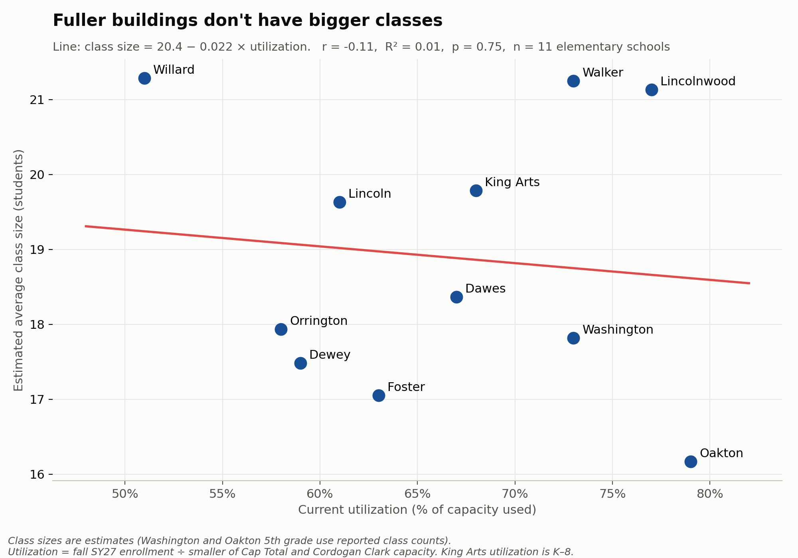
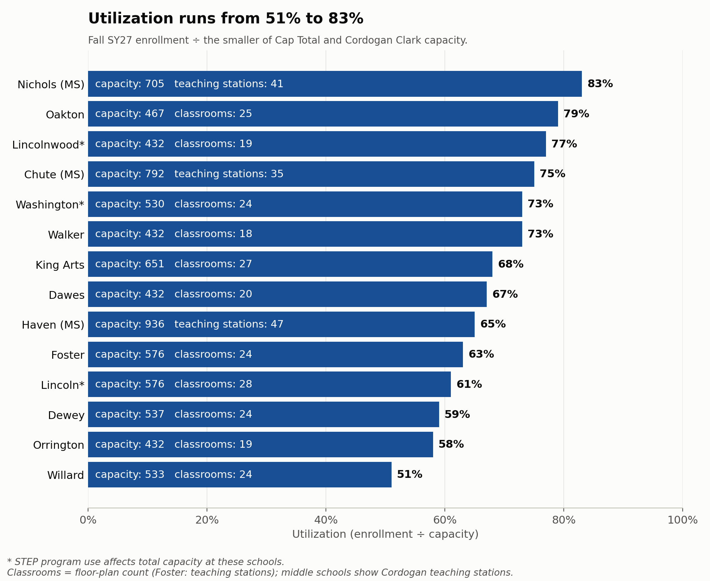
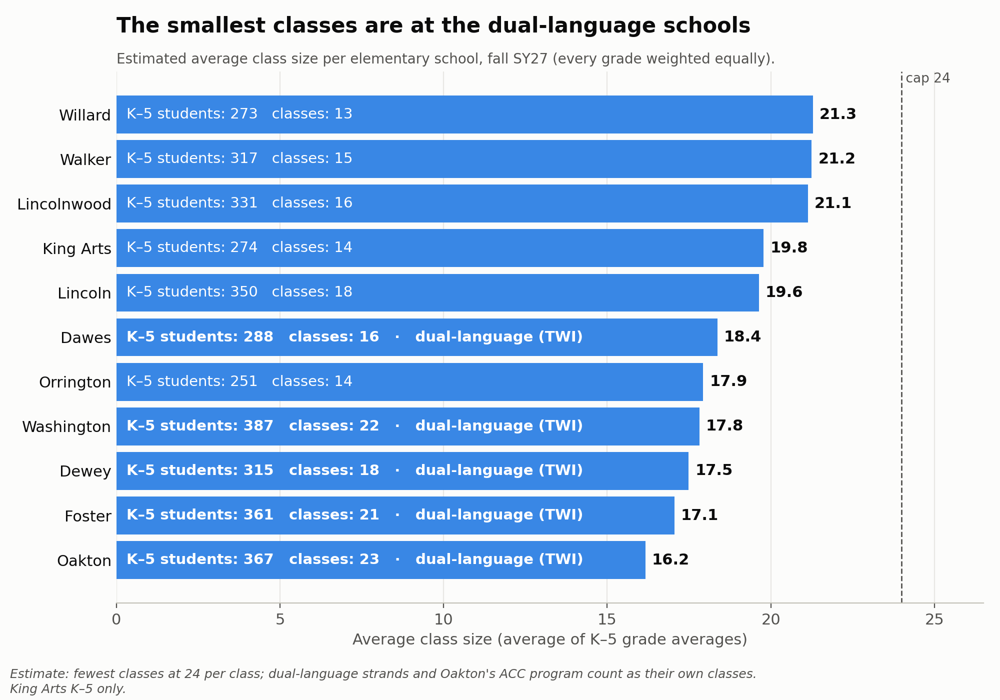
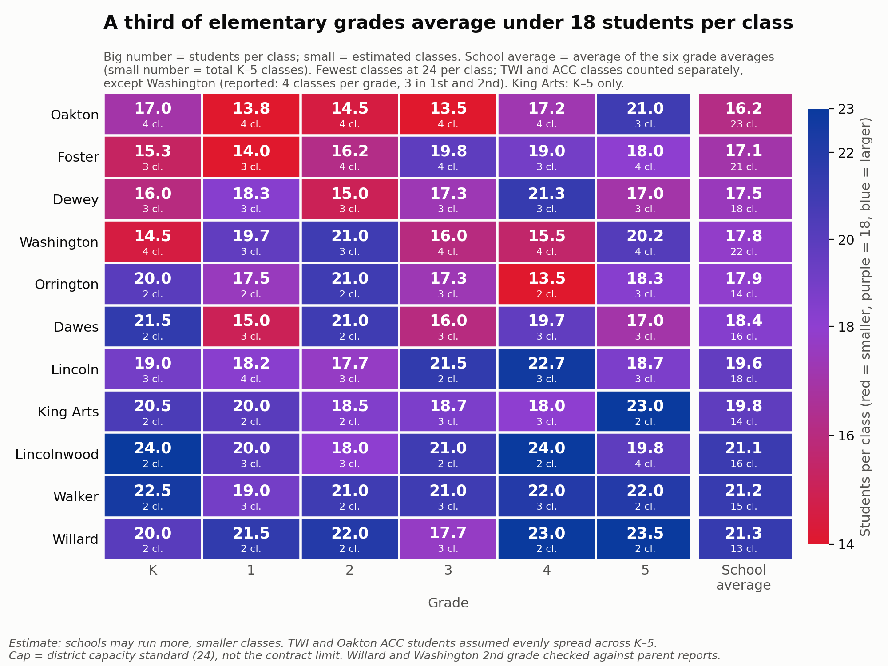

# SY27 Building Use, Class Size and Closure Costs

How District 65's buildings are used this fall: utilization, estimated class sizes, and what closing a school saves once added busing is counted. **Current data** is from the district's public dashboard, [data.district65.net](https://data.district65.net){:target="_blank"}, pulled September 23, 2026 (fall of school year 2026–27, "SY27"), and scraped by a Legion member ([source files](https://github.com/jmclip/enrollment_fall26){:target="_blank"}). **Planning data** is from the district's utilization and capacity tables and Cordogan Clark's February 2022 capacity study.

**Help with accuracy:** if you know actual class sizes at your school, please add them through the [crowdsourcing form](https://docs.google.com/forms/d/e/1FAIpQLSepZPKRXOA8HTbEoWf8sUmXK_UlhWkK4_6y4cl9NQLNEYL1Bw/viewform?usp=dialog){:target="_blank"}.

## Key findings

### 1. Fuller buildings don't have bigger classes: utilization and class size are unrelated

Each dot is an elementary school: current utilization against estimated average class size. The red line is a least-squares fit.

- **The line is flat.** Class size changes by about 0.02 students per point of utilization (r = −0.11, R² = 0.01, p = 0.75, 11 schools). Utilization explains about 1% of the difference in class size between schools.
- **The two extremes point opposite ways.** Oakton is the fullest building (79%) and has the smallest classes (16.2). Willard is the emptiest (51%) and has the largest (21.3).
- **What drives class size instead:** how each grade divides into classes, and programs (TWI, ACC) that add classes. A half-empty building can still have full classrooms, and a full building can have small ones.

### 2. Utilization runs from 51% to 83%

Utilization = fall SY27 enrollment ÷ capacity (the smaller of the district's Cap Total and Cordogan Clark's capacity).

- **STEP (\*)** program use reduces usable capacity at Lincoln, Lincolnwood and Washington.

### 3. The smallest classes are at the dual-language schools

Estimated average class size per school (average of its K–5 grades; King Arts K–5 only).

- **Five of the six smallest averages are TWI schools:** Oakton 16.2, Foster 17.0, Dewey 17.5, Washington 17.8 and Dawes 18.4. The sixth is Orrington, at 17.9.
- **TWI schools average 17.2 students per class; the other schools average 20.0.** Each strand adds its own class at every grade, whether or not it's full.
- **The largest classes are at schools with no programs:** Willard (21.3), Walker (21.2) and Lincolnwood (21.1).

*Class counts are estimated, because the dashboard reports enrollment by grade, not by class: the fewest monolingual/mainstream classes that keep each class at 24 or fewer, plus one class per TWI strand and one ACC class per grade at Oakton. Washington and Oakton's 5th grade use reported class counts. The full math is in the class-size section below.*

### 4. A third of elementary grades average under 18 students per class

Red is small classes, purple is about 18, and blue is large (up to the 24 cap). The last column is each school's average.

- **23 of the 66 school-grades are under 18.** They are concentrated at Oakton (5 of 6 grades), Dewey (4), and Dawes, Foster, Orrington and Washington (3 each).
- **Small grades split awkwardly.** Orrington's 4th grade has 27 students in 2 classes (13.5 each). A 25th student forces a second class.
- **Walker, Willard and Lincolnwood are blue almost everywhere.**

## Class-size math by school

<b>Show the class-size math</b>: students ÷ classes for every school and grade, the Oakton note, and the parent-report check

Students in the grade ÷ estimated classes = average class size (fall SY27, elementary, King Arts K–5 only).

| School | K | 1 | 2 | 3 | 4 | 5 | Avg | Program classes per grade |
|---|---:|---:|---:|---:|---:|---:|---:|---|
| Willard | 40 ÷ 2 = **20.0** | 43 ÷ 2 = **21.5** | 44 ÷ 2 = **22.0** | 53 ÷ 3 = **17.7** | 46 ÷ 2 = **23.0** | 47 ÷ 2 = **23.5** | **21.3** | – |
| Walker | 45 ÷ 2 = **22.5** | 57 ÷ 3 = **19.0** | 42 ÷ 2 = **21.0** | 63 ÷ 3 = **21.0** | 66 ÷ 3 = **22.0** | 44 ÷ 2 = **22.0** | **21.2** | – |
| Lincolnwood | 48 ÷ 2 = **24.0** | 60 ÷ 3 = **20.0** | 54 ÷ 3 = **18.0** | 42 ÷ 2 = **21.0** | 48 ÷ 2 = **24.0** | 79 ÷ 4 = **19.8** | **21.1** | – |
| King Arts | 41 ÷ 2 = **20.5** | 40 ÷ 2 = **20.0** | 37 ÷ 2 = **18.5** | 56 ÷ 3 = **18.7** | 54 ÷ 3 = **18.0** | 46 ÷ 2 = **23.0** | **19.8** | – |
| Lincoln | 57 ÷ 3 = **19.0** | 73 ÷ 4 = **18.2** | 53 ÷ 3 = **17.7** | 43 ÷ 2 = **21.5** | 68 ÷ 3 = **22.7** | 56 ÷ 3 = **18.7** | **19.6** | – |
| Dawes | 43 ÷ 2 = **21.5** | 45 ÷ 3 = **15.0** | 42 ÷ 2 = **21.0** | 48 ÷ 3 = **16.0** | 59 ÷ 3 = **19.7** | 51 ÷ 3 = **17.0** | **18.4** | 1 TWI |
| Orrington | 40 ÷ 2 = **20.0** | 35 ÷ 2 = **17.5** | 42 ÷ 2 = **21.0** | 52 ÷ 3 = **17.3** | 27 ÷ 2 = **13.5** | 55 ÷ 3 = **18.3** | **17.9** | – |
| Washington | 58 ÷ 4 = **14.5** | 59 ÷ 3 = **19.7** | 63 ÷ 3 = **21.0** | 64 ÷ 4 = **16.0** | 62 ÷ 4 = **15.5** | 81 ÷ 4 = **20.2** | **17.8** | 2 TWI (class counts reported) |
| Dewey | 48 ÷ 3 = **16.0** | 55 ÷ 3 = **18.3** | 45 ÷ 3 = **15.0** | 52 ÷ 3 = **17.3** | 64 ÷ 3 = **21.3** | 51 ÷ 3 = **17.0** | **17.5** | 1 TWI |
| Foster | 46 ÷ 3 = **15.3** | 42 ÷ 3 = **14.0** | 65 ÷ 4 = **16.2** | 79 ÷ 4 = **19.8** | 57 ÷ 3 = **19.0** | 72 ÷ 4 = **18.0** | **17.0** | 2 TWI |
| Oakton | 68 ÷ 4 = **17.0** | 55 ÷ 4 = **13.8** | 58 ÷ 4 = **14.5** | 54 ÷ 4 = **13.5** | 69 ÷ 4 = **17.2** | 63 ÷ 3 = **21.0** | **16.2** | 1 TWI + 1 ACC (5th: 3 classes, reported) |

*Each cell shows students in that grade ÷ estimated classes = average class size. "Avg" is the average of the six grade averages. "Program classes per grade" lists the dual-language (TWI) and ACC classes included in each grade's count. The rest are monolingual/mainstream classes. For example, Foster kindergarten = 2 TWI + 1 monolingual/mainstream = 3 classes. Monolingual/mainstream classes are the fewest that keep each class at 24 or fewer students. TWI and ACC students are assumed evenly spread across K–5, and Oakton ACC uses the 73 projected students. These are estimates, not reported class counts. Full detail: [`class_size_detail_by_school.csv`](https://github.com/jmclip/enrollment_fall26/blob/main/data/class_size_detail_by_school.csv).*

**Note on Oakton.** Oakton's TWI class sizes use the school's total TWI enrollment from the dashboard (75 students), averaged evenly across K–5 (about 12–13 per grade). The dashboard has no ACC enrollment data, so ACC is handled the same way: the 1A table's projected 73 ACC students, averaged across K–5 (about 12 per grade). Unless combined ACC + TWI enrollment in a grade is substantially larger than 25, the results hold: Oakton still needs one TWI class and one ACC class per grade, and the class counts and averages above don't change. We contacted the district on 2026-09-25 about Oakton's strands per grade and will update this when they respond.

**Checked against parent reports (as of 2026-09-24).** Parents reported 11 actual classes through the [crowdsourcing form](https://docs.google.com/forms/d/e/1FAIpQLSepZPKRXOA8HTbEoWf8sUmXK_UlhWkK4_6y4cl9NQLNEYL1Bw/viewform?usp=dialog). Ten were reported with confidence 4–5 out of 5 and a named source (the teacher, a conference, a class email list, the PTA or a child in the class). These are still second-hand reports, not district data. The source notebook (section 12) compares each report with the estimate above.

| School | Grades reported | Classes reported | Result |
|---|---|---:|---|
| Willard | K, 1, 2, 3, 4, 5 | 8 | **All 8 match the estimate within 2 students.** In grades 1 and 2 every class was reported: 1st grade 22 + 21 = 43, the same as the dashboard's 43. 2nd grade 22 + 21 = 43, against 44 on the dashboard (one parent gave a grade total of 42). |
| Washington | 2, 5 | 3 | **2nd grade matches; 5th grade is 3 above.** 2nd grade: a monolingual/mainstream class of 23 and a TWI class of 19, against an estimate of 21.0 (63 students in 3 classes). The notebook now uses Washington's reported class counts: 4 per grade, 3 in 1st and 2nd. 5th grade (81 students, 4 classes) is departmental, with reported classes of 23 against our 20.2. |

**Still unverified:** every other school's class counts, and class sizes at Washington outside 2nd and 5th grade. Washington's class counts per grade are reported, but its class sizes are still enrollment ÷ classes. **Foster** also has two TWI strands and stays on the estimate until parents report. Details: [`class_size_parent_check.csv`](https://github.com/jmclip/enrollment_fall26/blob/main/data/class_size_parent_check.csv).

## Closing schools: busing costs vs. building savings

Closing a school saves building costs, but some of its students then need a bus. **Added busing takes back roughly a fifth to two-fifths of the savings.** Closures still save money, but net savings are smaller than building costs alone suggest.

This section uses the district's own transportation estimates from the [School Closure Hub](https://www.district65.net/about/budget-finance/structural-deficit-reduction-plan/phase-iii-school-closures-hub){:target="_blank"}. Each table counts students at every school by how they get there: bus, hazard route, program placement or walk. We compare each closure scenario with today's schools, using the same year and the same hazard definition. Note that because we do not have current busing data, this is potentially more students bused than in SY 26-27

### Added bus riders

| Scenario | Compared with | New general-ed bus riders | Where they go |
|---|---|---:|---|
| Close Lincolnwood (2FR) | 1A (today) | **+84** | Orrington +92, Willard +19 |
| Close Willard (2DR) | 1A (today) | **+153** | Orrington +135, Lincolnwood +55 |
| Close Lincolnwood + Washington (3D) | last year's baseline | **+221** | Dewey +168, Orrington +88 |

*Riders = bus (more than 1.5 miles) + hazard + program placements (ACC, STEP, TWI). Special-education busing doesn't change. The 3D comparison uses last year's tables, so its baseline still has Kingsley open. Kingsley's own closure added almost no riders.*

**Most new riders are hazard riders**: students whose new walk crosses an unsafe route, not students who live more than 1.5 miles away. They cluster at one or two receiving schools, which keeps the number of new routes low.

### Savings after busing

| Scenario | Building savings | Added busing | **Net savings** |
|---|---:|---:|---:|
| Close Lincolnwood | $0.45–0.81M | $0.09–0.18M | **$0.27–0.72M** |
| Close Willard | $0.47–0.82M | $0.18–0.33M | **$0.13–0.64M** |
| Close Lincolnwood + Washington | $0.95–1.43M | $0.27–0.48M | **$0.47–1.16M** |

*Yearly. Net low = low savings minus high busing cost; net high = the reverse.*

**Building savings.** These are the costs that go away with the building:
- the principal ($181K with benefits, FY26 salary disclosure)
- one office position ($60K, assumed)
- about 2.5 custodians ($65K each, assumed)
- 2025 utilities (Lincolnwood $50K, Willard $62K, Washington $90K)

The high end adds a librarian ($133K), an assistant principal ($160K) and a health clerk, but only if those positions are actually cut. None of these figures include savings from combining classes.

**Added busing.** The low end assumes new double routes at about $90K each, each carrying about 110 riders over two runs. The high end is the district's average cost per general-education rider: about $2,200 ($2.4M in general-ed routes ÷ 1,104 riders today). Costs are from the district's [Transportation Memo](https://ig.foiagras.com/api/public/chat/documents/15622/view){:target="_blank"} (Feb 9, 2026).

### What's not included

- One-time costs: moving, and renovating receiving schools, including space for TWI and STEP.
- Avoided capital and maintenance at closed buildings. This could be the largest saving.
- Families who leave the district, and changes in state funding.
- Crossing guards or route changes that could remove a hazard designation and the busing that goes with it.

Calculations: [`build_enrollment_26.py`](https://github.com/d65-legionofnerds/d65-legionofnerds.github.io/blob/main/dataanalysis/build_enrollment_26.py){:target="_blank"}. Data: the 1A, 2DR and 2FR tables are in [`data/`](https://github.com/d65-legionofnerds/d65-legionofnerds.github.io/tree/main/dataanalysis/data){:target="_blank"}. Last year's baseline and Scenario 3D tables, plus the results (`closure_transportation_summary.csv`, `closure_transportation_by_school.csv`), are in [`data/enrollment_26/`](https://github.com/d65-legionofnerds/d65-legionofnerds.github.io/tree/main/dataanalysis/data/enrollment_26){:target="_blank"}.

## Replication and technical details

<b>Show replication and technical details</b>: how the data was collected, how to refresh, methods and definitions, checks, and known limitations

### How the data was collected

- **Current data** comes from the district's public dashboard, [data.district65.net](https://data.district65.net), a Plotly Dash app. Its charts come from requests to `/_dash-update-component`.
- **The pull (2026-09-23):** those same requests were made for the district as a whole and for each of the 14 schools (Home, Attendance, Discipline, and all five assessments), plus every building's utility data. The chart data was decoded into the tidy CSVs in the [source repo](https://github.com/jmclip/enrollment_fall26).
- **Checks:** every school had to add up to the district totals. The dashboard's filter is shared between visitors, so each school was also checked for internal consistency.
- **Planning data** comes from two district tables (typed in from screenshots) and Cordogan Clark's February 2022 capacity report (PDF). See [`sources/sources.md`](https://github.com/jmclip/enrollment_fall26/blob/main/sources/sources.md).

Full replication details, the endpoints and the scraper are in **[`scraping/README.md`](https://github.com/jmclip/enrollment_fall26/blob/main/scraping/README.md)**.

### How to refresh

1. In the [source repo](https://github.com/jmclip/enrollment_fall26): run `scraping/d65_scrape.py` to pull the dashboard again, then run `d65_enrollment_by_building.ipynb` top to bottom. The notebook estimates classes and writes the CSVs.
2. Copy `class_size_detail_by_school.csv`, `utilization_current_vs_predicted.csv`, `capacity_comparison.csv` and `twi_strands.csv` into `dataanalysis/data/enrollment_26/` here.
3. Run `python3 dataanalysis/build_enrollment_26.py` (needs pandas, matplotlib and scipy). It redraws the four charts in `assets/` and recomputes the busing tables.

The dashboard stores filtered results in one shared spot on its server, so another visitor filtering at the same moment can mix up numbers. The scraper re-runs any school whose totals don't add up, and checks that schools sum to the district.

### Methods and definitions

| Term | Definition |
|---|---|
| **Current enrollment** | Dashboard enrollment, fall SY27 |
| **Projected enrollment** | "Enroll Total" in the district tables, a district projection. The elementary projections come from the Cordogan table; Chute, Haven and Nichols from the 1A table |
| **Cap Total** | District baseline capacity = 24 × calculated teaching stations |
| **Capacity used** | The smaller of Cap Total and Cordogan Clark capacity. Middle schools' Cordogan capacity comes from the report (PDF); their Cap Total and projections come from the 1A table |
| **Capacity goal** | Cordogan Clark's target utilization: 85% elementary, 80% middle, 75% Park/Rhodes/King Arts, 90% JEH (in `cordogan_clark_2022_report.csv`) |
| **Utilization** | Enrollment ÷ capacity used. Predicted utilization = projected enrollment ÷ Cap Total, as the district computed it |
| **STEP (\*)** | STEP program use affects total capacity at Lincoln, Lincolnwood and Washington |
| **Classrooms** | The district's floor-plan classroom count (capacity screenshot). Foster uses its teaching-station count because its floor-plan figure is blank. Middle schools have no floor-plan count; charts show their Cordogan teaching stations |
| **Building square feet** | (Electric + gas MMBtu) × 1,000 ÷ EUI (kBtu per sq ft), using 2025. 2018 gives the same result within about 25 sq ft. Accurate to roughly ± a few hundred sq ft |
| **Learning space** | Cordogan "Total SF Core Classrooms + SPED" (plus science labs at middle schools) ÷ building square feet |
| **Area capture** | Current enrollment ÷ students living in the attendance area ("Area Counts"). The neighborhood version subtracts TWI students, so it undercounts at TWI schools, since some TWI students live nearby |
| **Utility cost** | Electric, gas and water, calendar 2025, the last full year. Cost per student uses fall SY27 enrollment |
| **TWI strand** | One dual-language class per grade K–5 (6 rooms, 144 seats). TWE/TWS = English/Spanish-dominant; TWX as labeled by the district (meaning not confirmed) |

#### Class-size estimate

The dashboard has enrollment by grade, not how many classes each grade has, so classes are **estimated**:

- **Monolingual/mainstream classes:** the fewest classes that keep each class at or under the cap, `ceil(students ÷ 24)`. This gives the fewest classrooms and largest average class a grade could have. Real schools may run more, smaller classes.
- **Cap = 24:** the district's capacity standard, not the teacher-contract limit. Change `CAP` in the notebook to use grade-level limits.
- **TWI schools (Dawes, Dewey, Foster, Oakton, Washington), K–5:** one class per strand per grade. TWI students are assumed spread evenly across K–5.
- **Washington (reported class counts):** 4 classes per grade (2 TWI + 2 monolingual/mainstream), except 1st and 2nd grade with 3 (2 TWI + 1). Students are spread evenly across a grade's classes. Set in `KNOWN_CLASSES` in the notebook.
- **Oakton 5th grade (reported class count):** 3 classes instead of 4, assumed to be 1 TWI + 1 ACC + 1 monolingual/mainstream, with students spread evenly. Also set in `KNOWN_CLASSES`.
- **Oakton ACC:** one ACC (African-Centered Curriculum) class per grade K–5. The dashboard doesn't identify ACC students, so the 1A table's projected 73 are spread evenly (~12 per grade) and taken out of Oakton's monolingual/mainstream classes. Change `acc_total` in the notebook if you have the actual count.
- **Middle schools:** sections of up to 24 students, since there are no homerooms. They're excluded from the elementary summaries, and King Arts counts K–5 only there.

### Checks

- School enrollments, IEP counts and incidents add up to district totals (5,462 / 953 / 968).
- Every grade's school enrollments add up to the district total for that grade.
- Transcribed tables: parts add up to Enroll Total, and every Util % and Cordogan Delta recomputes.
- The capacity screenshot's Cordogan figures (square feet, teaching stations, capacity) match Cordogan Clark's February 2022 report for all 11 schools it covers. The notebook asserts this on every run.
- Transcriptions were checked byte for byte (checksums) when moving the dashboard data.

### Known limitations and data to request

- **Class counts are estimates.** Actual sections by school and grade would replace them.
- **TWI by grade:** needed to model the dual-language scenarios room by room.
- **Current ACC enrollment at Oakton:** the model uses the 73 projected.
- **Middle schools:** the Cordogan report gives their teaching stations, capacity and classroom square feet, but there's no floor-plan classroom count, so they're left out of the classrooms-needed comparison.
- **Foster:** has no utility account on the dashboard, so there's no square footage or cost for it.
- **Classroom counts** may include art, music or library rooms, so spare-room figures are upper bounds.
- **The dashboard's shared filter** can cross results between visitors; see How to refresh.
- **[`scraping/d65_scrape.py`](https://github.com/jmclip/enrollment_fall26/blob/main/scraping/d65_scrape.py) hasn't been run end to end against the live site.** The first pull went through a browser, and the script's chart-decoding code was tested against real responses. Expect small fixes on its first run.

See [`sources/sources.md`](https://github.com/jmclip/enrollment_fall26/blob/main/sources/sources.md) for where each number comes from.

---

*Made with help from Claude (an AI model), which can make mistakes, including in transcribing data, in calculations and in interpretation. Please verify figures against the sources before relying on them.*
