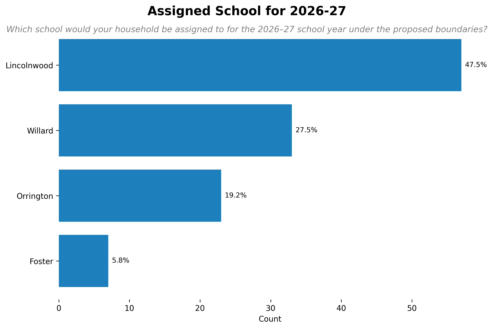
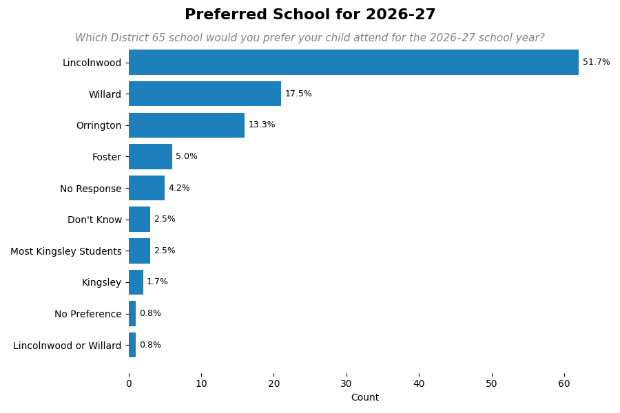
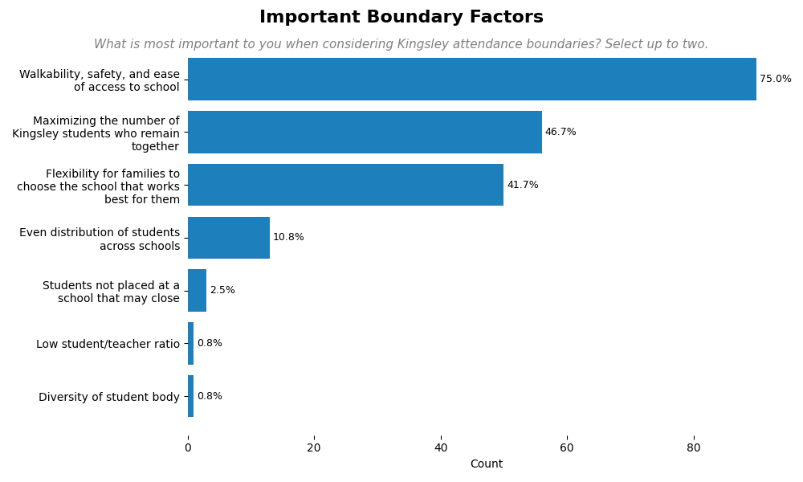
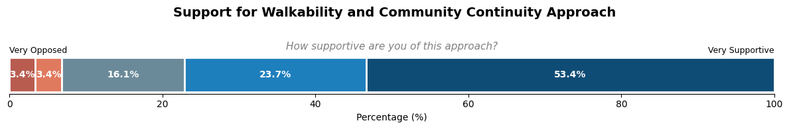
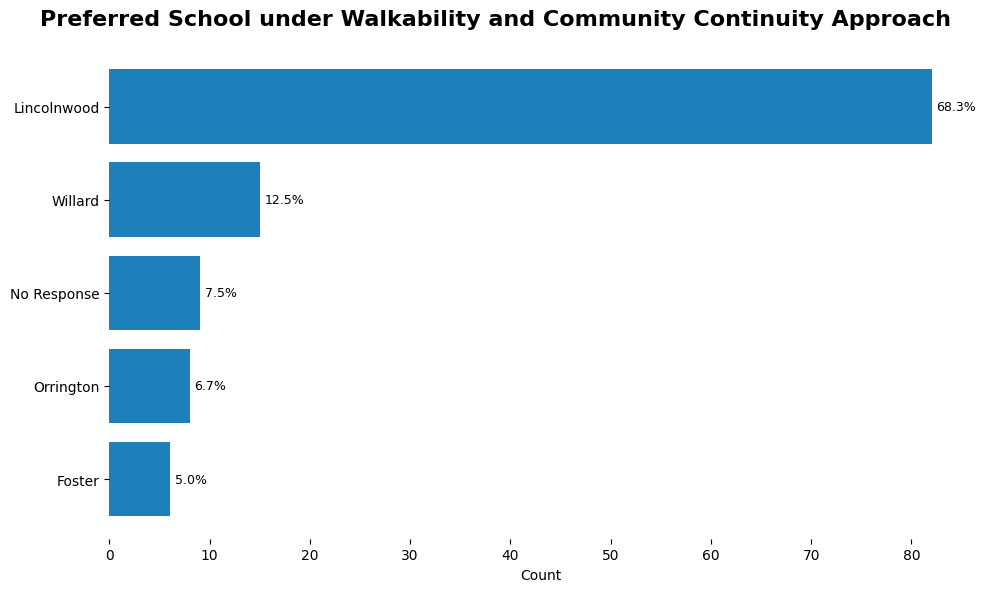
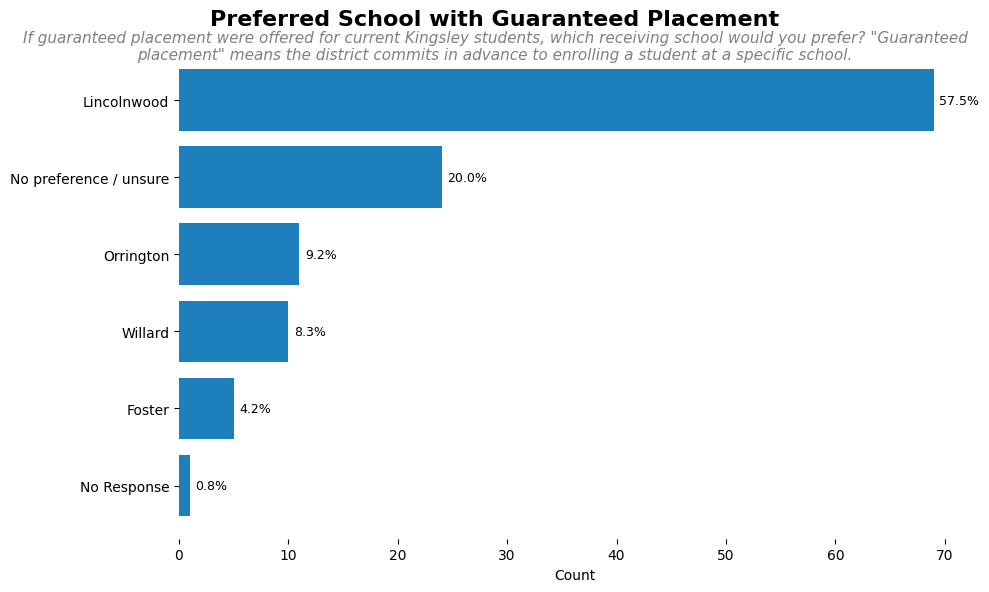
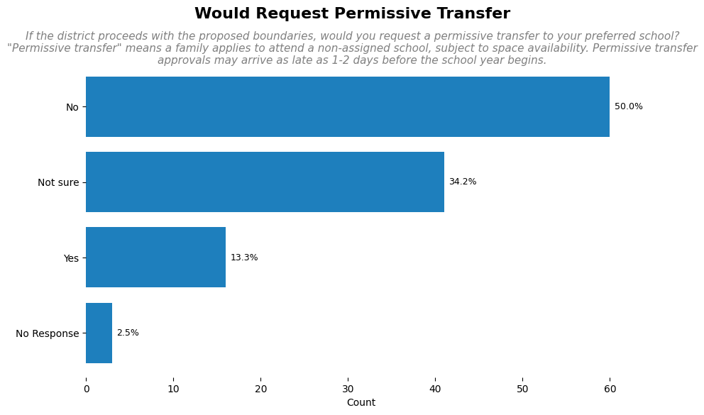

# Kingsley Closure Analysis

## Introduction

District 65 is working through a multi-phase Structural Deficit Reduction Plan (SDRP) to address budget deficits and achieve long-term financial sustainability. As part of SDRP Phase III, the district considered multiple school closure scenarios. On January 9, 2026, the Board of Education passed a resolution to proceed with the legally required public hearings to close Kingsley School at the end of the 2025–26 school year. More information is available on the [District 65 SDRP website](https://www.district65.net/about/budget-finance/structural-deficit-reduction-plan).

The purpose of this survey is to gather current, prospective, and former Kingsley parents’ perspectives on school transitions, supports that may ease the transition to a new school, and concerns related to this process.

This survey was created by Kingsley parents in partnership with the [Legion of Data Nerds](https://d65-legionofnerds.github.io/) and is not affiliated with the District 65 administration or Board of Education. Aggregate results will be shared with District 65 leadership to ensure Kingsley families’ perspectives are represented.

## Methodology

The survey was sent to 470 parent emails on the Kingsley PTA mailing list and was circulated through community grassroots text messaging. The survey opened on Friday morning January 16, and data collection closed at 10pm on Monday January 19. The survey received 120 responses that accepted the informed consent for an estimated response rate of 25%.

The survey contained 20 questions on school boundaries, transition support, intent to stay in District 65, and demographics.

## Results
Most respondents are assigned to Lincolnwood school based on the drawn boundaries.

Lincolnwood emerged consistently as the most preferred receiving school.

69% indicated that their assigned school under the proposed boundaries is also their preferred school for 2026–27. 

<iframe src="assets/kingsley_survey/assigned_vs_preferred_school.html" width="100%" height="650" frameborder="0"></iframe>

Survey results show strong alignment between Kingsley families and the district’s attendance boundaries for families entering the district in fall of 2026. A large majority of respondents (75%) identified walkability, safety, and ease of access as the most important factors in setting future boundaries.

The survey asked respondents to what extent they would support a districting approach to maximize walkability and community continuity by assigning walkable attendance boundaries, and also offering guaranteed placement at a designated Kingsley receiving school for those that request it, without requiring permissive transfers. There was overwhelming support (78%) for this approach.

68% of respondents preferred Lincolnwood be instated as the preferred receiving school. The question noted that Lincolnwood may be an ideal school for this approach given its central location and proximity to Kingsley.

If guaranteed placement were offered for current Kingsley students, Lincolnwood is the ideal receiving school for most respondents (58%)

Most respondents (50%) would not request a permissive transfer in which a final placement would not be known until just before the new school year begins.

