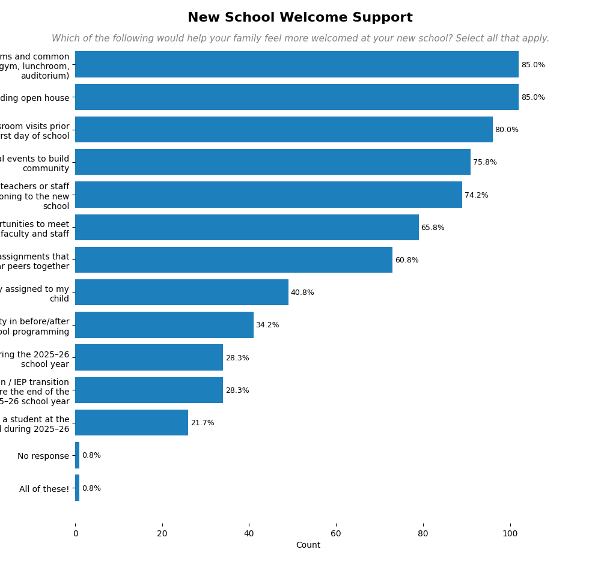
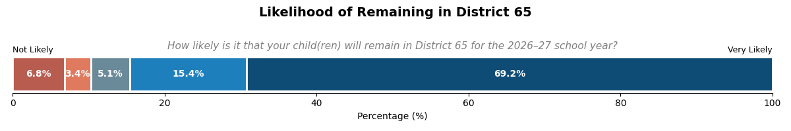
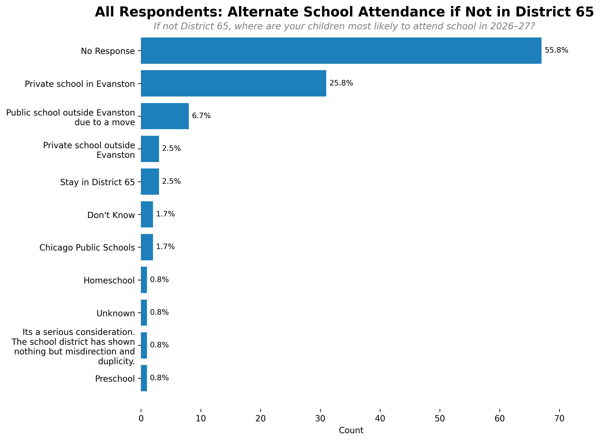
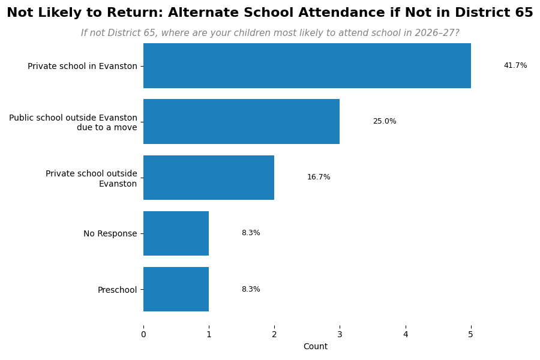
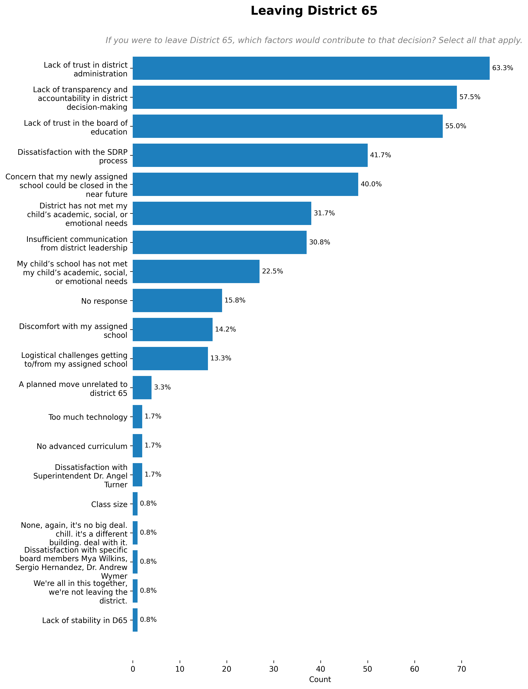
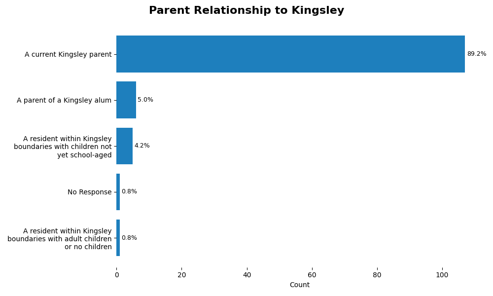
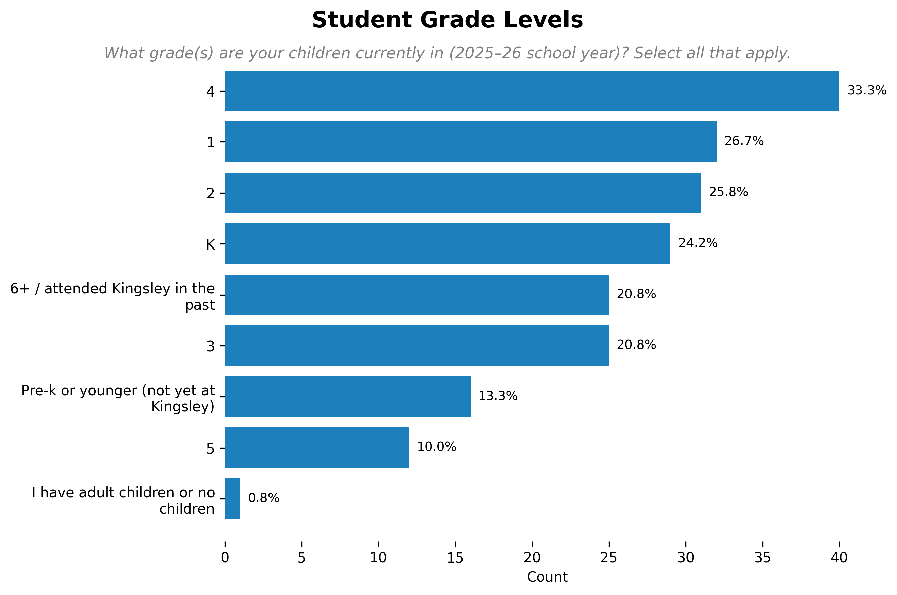

# Kingsley Closure Analysis

## Introduction

District 65 is working through a multi-phase Structural Deficit Reduction Plan (SDRP) to address budget deficits and achieve long-term financial sustainability. As part of SDRP Phase III, the district considered multiple school closure scenarios. On January 9, 2026, the Board of Education passed a resolution to proceed with the legally required public hearings to close Kingsley School at the end of the 2025–26 school year. More information is available on the [District 65 SDRP website](https://www.district65.net/about/budget-finance/structural-deficit-reduction-plan).

The purpose of this survey is to gather current, prospective, and former Kingsley parents’ perspectives on school transitions, supports that may ease the transition to a new school, and concerns related to this process.

This survey was created by Kingsley parents in partnership with the [Legion of Data Nerds](https://d65-legionofnerds.github.io/) and is not affiliated with the District 65 administration or Board of Education. Aggregate results will be shared with District 65 leadership to ensure Kingsley families’ perspectives are represented.

If you have questions about this survey, please contact:
Lauren McNamara, lauren.mcnamara@gmail.com
Robin Telander, robin.telander@gmail.com

## Methodology

The survey was sent to 470 parent emails on the Kingsley PTA mailing list and was circulated through community grassroots text messaging. The survey opened on Friday morning January 16, and data collection closed at 10pm on Monday January 19. The survey received 120 responses that accepted the informed consent for an estimated response rate of 25%.

The survey contained 20 questions on school boundaries, transition support, intent to stay in District 65, and demographics.

The complete analysis can be found in this [Jupyter notebook](kingsley_closure_survey.ipynb).

### Data Preparation

The dataset was checked for duplicate emails and none were found. Respondents who answered "no" at the informed consent statement were not included in the analysis.

Many questions offered an "Other - specify" response. These texts provided nuance and insight, but to facilitate analysis these responses were recoded into existing or common topics where possible. The recoding details are available in the [Jupyter notebook](kingsley_closure_survey.ipynb).

## Results

### School Boundaries

Most respondents are assigned to Lincolnwood school based on the drawn boundaries.

Lincolnwood emerged consistently as the most preferred receiving school.

69% indicated that their assigned school under the proposed boundaries is also their preferred school for 2026–27, but many respondents would prefer the flexibility to choose the school that is right for them.

<iframe src="assets/kingsley_survey/assigned_vs_preferred_school.html" width="100%" height="650" frameborder="0"></iframe>

Survey results show strong alignment between Kingsley families and the district’s attendance boundaries for families entering the district in fall of 2026. A large majority of respondents (75%) identified walkability, safety, and ease of access as the most important factors in setting future boundaries.

Respondents simultaneously expressed concern about the potential loss of Kingsley’s close-knit community. 75% of survey respondents either prioritized maximizing the number of students who remain together or offering flexibility for families to choose the school that works best for them.

The survey asked respondents to what extent they would support a districting approach to maximize walkability and community continuity by assigning walkable attendance boundaries, and also offering guaranteed placement at a designated Kingsley receiving school for those that request it, without requiring permissive transfers. There was overwhelming support (78%) for this approach.

68% of respondents preferred Lincolnwood be instated as the preferred receiving school. The question noted that Lincolnwood may be an ideal school for this approach given its central location and proximity to Kingsley.

If guaranteed placement were offered for current Kingsley students, Lincolnwood is the ideal receiving school for most respondents (58%)

Most respondents (50%) would not request a permissive transfer in which a final placement would not be known until just before the new school year begins.

### Transition Support

Survey respondents were presented with several ways that a new school might welcome incoming Kingsley students, and asked to select all that they felt would help their children feel welcomed. Most ideas received strong support, with the top rated being ways that incoming students can enter and explore the new building.

<!--  -->

### Intent to Stay

Respondents were asked how likely it is that their child(ren) would remain in District 65 for the 2026-27 school year. The large majority (85%) indicated they were likely to remain, but 10% of respondents indicated they were likely to leave District 65.

All respondents were asked where their children were most likely to attend school if not District 65. Most (56%) skipped the question, and the most common provided responses were private school in Evanston or public school outside of Evanston due to a move.

Among respondents not likely to stay in District 65, the most common school alternatives were private school in Evanston (42%) or public school outside Evanston due to a move (25%).

Respondents were presented with a number of factors that may cause dissatisfaction with District 65 and asked to select all that may contribue to a choice to leave the district. The most commonly cited reasons were lack of trust in district administration (63%), lack of transparency and accountability in district decision-making (58%), and lack of trust in the board of education (55%).

## Demographics

Most respondents were a current parent of a Kingsley student (89%).

All grade levels were represented with 4th grade parents being the most common respondents.

## Discussion

Kingsley parents are supportive of the walkable boundaries drawn and most intend to remain in District 65 next year. However, there is also broad community support for allowing early guaranteed placement to keep the current Kingsley cohorts together, and strong sentiments of dissatisfaction at the district leadership level. 

Kingsley parents identified numerous ways to help ease their children's transition to a new school, foremost being ample opportunities to tour and become familiar with the new spaces.