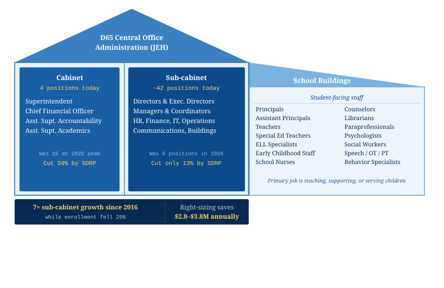

# What Happens When Parents Get Serious About Public Records

## A guest post by the Legion of Data Nerds

---

The [Legion of Data Nerds](https://d65-legionofnerds.github.io/) is a group of District 65 parents who are focused on data, transparency, and ensuring that decisions affecting our students are made with sound methodology and accurate data. We publish replicable analyses on our website to help others understand the current situation of District 65. 

---

## What We Found

Over the past month, we [published](https://d65-legionofnerds.github.io/dataanalysis/d65_org_structure_analysis) two analyses of D65's [administrative structure](https://d65-legionofnerds.github.io/dataanalysis/admin-growth-final.html). In our analyses, we focus on administration in the district, excluding principals and assistant principals, referring to central office administrators (as the bulk of administrators in our analyses are located at Joseph E. Hill (JEH), District 65’s central administration office). Together, our analyses tell a single story: over the past decade, D65's central office more than tripled in size, increasing costs while student enrollment declined 25%.

Before presenting our analysis in detail, we present a visual of staff structures within the district. There are central office administrators (in the two leftmost boxes) and additional positions in the school buildings (such as principals, teachers, counselors, etc.). Our analyses focus on central office administrators.

Much of the public debate has focused on "the cabinet," the senior leaders who sit at the dais at board meetings. But the layer beneath the cabinet, the "sub-cabinet," has received far less scrutiny and remained largely intact after the District's cost-cutting.

District 65 undertook a [Structural Deficit Reduction Plan (SDRP)](https://www.district65.net/about/budget-finance/structural-deficit-reduction-plan) in 2024, aiming to cut costs and address longstanding budget issues. The asymmetry in how those cuts landed is striking. The cabinet was cut 50% under the SDRP, finishing below its 2016 starting point. The sub-cabinet contracted by just 13% and still sits at seven times its original size. Right-sizing it to peer-district norms would save $2.8 to $3.8 million annually, without touching a single principal, teacher, counselor, or librarian ([see more on peer districts and calculations here](https://d65-legionofnerds.github.io/dataanalysis/salary-data.html)).

**Cabinet:** The superintendent's senior leadership team. This is the small group of executives who report directly to the superintendent and set district-wide strategy (e.g., Superintendent, Chief Financial Officer, Assistant Superintendents, etc.).

**Sub-cabinet:** The administrative layer beneath the cabinet, such as directors, managers, and coordinators. They run specific program areas and operational functions from the central office, with little or no direct contact with students (e.g., Director of Curriculum, Executive Director of Technology, Director of HR, Director of Finance, Director of Equity and Family Engagement, etc.).

**Student-facing staff:** Principals, educators, specialists, and support professionals who work in school buildings. Their primary job is teaching, supporting, or serving children, not managing district operations (e.g., Teachers, Counselors, Paraprofessionals, School Psychologists, Speech Therapists, Principals, etc.)

With those distinctions in mind, here's what the data show:
**[The Org Chart That Ate Our Budget](https://d65-legionofnerds.github.io/dataanalysis/d65_org_structure_analysis.html)** traces D65's administrative growth from 2016 to today using board org charts, state salary disclosures, and [financial data submitted by D65 to the Illinois State Board of Education (ISBE)](https://www.isbe.net/Pages/Annual-Financial-Report.aspx). The headline findings:

- Enrollment fell **25%** — the steepest decline among [21 peer K-8 districts](https://d65-legionofnerds.github.io/dataanalysis/enrollment-data.html) that cannot be explained by demographic shifts alone
- Per-student administrative spending rose **55%** after adjusting for inflation
- The sub-cabinet (the layer of directors, coordinators, and program managers below the superintendent that do not directly and regularly interact with students) grew **7 times its 2016 size** and was barely touched by the District's cuts during the District's SDRP.
- The District officially reports **52** central administrators; cross-referencing three public state disclosure lists reveals at least **64**, indicative of how difficult it is to get an accurate picture of the district's own administrative structure.
- D65 spends **$619 per student** on [Special Area Administration Services](https://www.isbe.net/Documents/mechanics.pdf) against a peer average of **$176**. These programs include, for example, supervisor – Federal Programs, Special Programs & Title Programs.

| Metric | Value |
|---|---|
| Enrollment decline | **-25%** · steepest among 21 peer districts |
| Sub-cabinet growth since 2016 | **7×** · left largely intact by SDRP |
| Per-pupil admin spending (inflation-adjusted) | **+55%** |
| Official vs. actual admin count | **52→64+** · cross-referencing public lists |
| Per-pupil Special Area Admin | **$619** · vs. peer average of $176 |

*From [The Org Chart That Ate Our Budget](https://d65-legionofnerds.github.io/dataanalysis/d65_org_structure_analysis.html)*

The figure below shows how D65's central office grew during the tenure of former Superintendent Devon Horton.

*Stacked bar chart showing cabinet and sub-cabinet administrative positions at D65 from 2016–17 through 2025–26. The SDRP dramatically cut the cabinet but left the sub-cabinet largely intact. Cabinet: 8, 8, 9, 10, 12, 6. Sub-cabinet: 6, 9, 20, 38, 48, 42.*

**Legend:** Cabinet (asst. superintendents, chiefs, deputy superintendent) · Sub-cabinet (directors, coordinators, managers) · Post-SDRP (2025–26) · Horton era (2019–2023)

> \* 2020–21 sub-cabinet figure (~20) is a partial estimate. The 2020-21 org chart documents cabinet-level expansion but does not enumerate all sub-cabinet positions with the same specificity as later years. The true figure likely falls between the 2019 Summer baseline (9) and the 2021-22 count (38); ~20 reflects a conservative midpoint estimate. All other data points are drawn from named positions in primary source documents.
>
> Sources: D65 org charts (FOIA Gras docs 4479, 3906, 3180), [PA 96-0434](https://www.ilga.gov/Legislation/publicacts/view/096-0434) Teachers Retirement System (TRS) Administrator reports for teachers and licensed teacher members (docs 1640, 4133), [Gavin budget document analysis](https://github.com/d65-legionofnerds/d65-legionofnerds.github.io/blob/main/dataanalysis/data/Gavin%20FOIA%20Response%205.14.24-6.pdf) (May 2024 FOIA response). **Note:** figures reflect named positions traceable through org charts and budget documents (cabinet + sub-cabinet = 48 for 2025–26). The separately documented count of 64 total administrators draws on all three state disclosure lists and captures additional positions not visible in org charts — see the Undercounting Problem callout [in our original post](https://d65-legionofnerds.github.io/dataanalysis/d65_org_structure_analysis.html#3-tell-the-community-what-the-administrative-structure-actually-costs-and-does).
>
> ‡ FOIA Gras document numbers refer to records in the [FOIA Gras](https://foiagras.com) D65 document library. Documents can be searched by number or keyword using the [FOIA Gras MCP integration](https://foiagras.com/mcp/).

**[District 65 Administrative Growth Over Time](https://d65-legionofnerds.github.io/dataanalysis/admin-growth-final.html)** is a companion budget analysis documenting the compensation trends in granular detail using salary compensation reports required to be posted by the state of Illinois ([PA 96-0434](https://www.ilga.gov/Legislation/publicacts/view/096-0434) and [PA 97-0609](https://www.ilga.gov/Legislation/publicacts/view/097-0609)) and [ISBE Annual Financial Reports](https://www.isbe.net/Pages/Annual-Financial-Report.aspx). All three Python scripts used in the analysis are published so that anyone can download the data, run the code, and see exactly how every figure was calculated.

The chart below shows the administrative compensation pool growing in inflation-adjusted dollars over a decade of enrollment decline, contributing to the budget deficit. 

*From [District 65 Administrative Growth Over Time](https://d65-legionofnerds.github.io/dataanalysis/admin-growth-final.html)*

*Source: [ISBE Annual Financial Reports](https://www.isbe.net/Pages/Annual-Financial-Report.aspx) (AFR), inflation-adjusted to 2026 dollars using [BLS CPI-U](https://www.bls.gov/cpi/). Categories: General Administration, School Administration, Business, Operations. Full methodology: [admin-growth-final.html](https://d65-legionofnerds.github.io/dataanalysis/admin-growth-final.html#methodology-notes)*

The compensation data puts a price on the role growth. [While peer districts held per-pupil administrative spending roughly flat in inflation-adjusted terms, D65's rose steadily](https://d65-legionofnerds.github.io/dataanalysis/salary-data.html#total-administrative-salary-expenditure). This increase was driven not by rising salaries at the top but by the accumulation of positions across the second tier.

---

## Why This Matters

The D65 administration claims it has cut itself "to the bone" and this is why remaining budget cuts must now be student-facing, including closing schools and cutting positions like school counselors and librarians. Our analysis shows that our district was previously able to operate with a much smaller central office staff.

The members of the Legion of Data Nerds cross many disciplines but we do not have specific expertise in school district administration. It may take more administrators to run a district now than it did ten years ago. The administration has not explained why current staffing levels are necessary, nor was administrative staffing substantively addressed during the fall budget discussions.

We highlight this information to show another area for potential savings. We are concerned parents who are offering our analytical expertise to the District, Board, and community in service of optimal outcomes for every student. We are ready and willing to partner with the Board and Administration to refine these findings or turn them into meaningful change.

---

## Replication and FOIA Gras

This analysis drew on multiple public data sources, which we combined into comprehensive datasets and published in full so anyone can replicate or challenge our findings. FOIA Gras was instrumental in collecting this information.

The [FOIA Gras Inspector General](https://foiagras.com/inspector-general/) is a public archive of hundreds of board presentations, salary disclosures, budget documents, FOIA responses, and financial reports. It gave us the primary source foundation that serious analysis requires. But Tom Hayden went further than that: sharing documents directly, offering feedback on our methodology as the work evolved, and staying engaged as we revised and refined.

We also used the [FOIA Gras MCP integration with Claude](https://foiagras.com/mcp/) to query the Inspector General archive directly in our research workflow, pulling specific documents, searching across thousands of pages, and surfacing connections we would not have found manually. The [MCP (model context protocol)](https://support.claude.com/en/articles/11175166-get-started-with-custom-connectors-using-remote-mcp) allows for a connection to FOIA Gras' collection of files based on simple questions, such as 'enrollment changes over time' using Claude as an AI tool. If you are doing serious local accountability work and you are not using this tool, you should be.

---

*The Legion of Data Nerds is a parent group conducting data-driven accountability work on Evanston/Skokie School District 65 budget and governance. All analyses, data, and code are publicly available at [d65-legionofnerds.github.io](https://d65-legionofnerds.github.io).*
